# Documentação Modelo Preditivo - Inteli

## IBMatch
### Equipe IBMatch:
#### Felipe Zillo, Gustavo Gonçalves, Karine Victoria, Larissa Temoteo, Vinicius Testa, Wildisley Filho.

## Sumário
[1. Introdução](#c1)

[2. Objetivos e Justificativa](#c2)

[3. Metodologia](#c3)

[4. Desenvolvimento e Resultados](#c4)

[5. Conclusões e Recomendações](#c5)

[6. Referências](#c6)

[Anexos](#attachments)


## <a name="c1"></a>1. Introdução

&nbsp;&nbsp;&nbsp;&nbsp;A [IBM](https://www.ibm.com/br-pt) (_International Business Machines_), parceria de projeto, é uma multinacional da área da tecnologia voltada para o mercado corporativo, com grande enfoque no fornecimento de serviços de consultoria especializada, nuvem híbrida e inteligência artificial, além de vastas contribuições em áreas de pesquisa, inovação e desenvolvimento de novas tecnologias [[1]](#6-referências) [[2]](#6-referências).

&nbsp;&nbsp;&nbsp;&nbsp;A empresa parceira, apesar de sua grande expertise no desenvolvimento de sistemas de inteligência artificial e modelos preditivos, não dispõe de um modelo capaz de prever resultados e gerar métricas de partidas de futebol, o que limita sua atuação no mercado de análises esportivas [[2]](#6-referências). 

&nbsp;&nbsp;&nbsp;&nbsp;Nesse sentido, o presente projeto visa atacar tal questão, conforme detalhado na [Seção 2](#2-objetivos-e-justificativa). 

## <a name="c2"></a>2. Objetivos e Justificativa
### 2.1 Objetivos

&nbsp;&nbsp;&nbsp;&nbsp;Tomando como base o Termo de Abertura de Projeto Inteli (TAPI), tem-se como objetivo do projeto:

> "Desenvolver uma solução para ser utilizada dentro de um estádio durante partidas de futebol, onde com a utilização de modelos preditivos baseados em técnicas de aprendizado supervisionado, possamos prever com base em dados históricos, por exemplo, qual time vai ganhar o jogo? Qual time vai fazer o primeiro gol? Quem vai fazer o primeiro gol? Qual etapa (tempo) tem mais probabilidade de sair o primeiro gol? Qual será o placar?"

&nbsp;&nbsp;&nbsp;&nbsp;Nesse sentido, identifica-se como objetivos principais a elaboração de um modelo preditivo capaz de gerar estatísticas e prever resultados de partidas de futebol. Além disso, por meio de trocas com o parceiro de projetos, também foi esclarecido que um dos objetivos da solução proposta é a demonstração do potencial de mecanismos de inteligência artificial na análise de dados, de modo que a solução também seja usada como uma "vitrine" para apresentar outros produtos e serviços da empresa. 

### 2.2 Proposta de solução

&nbsp;&nbsp;&nbsp;&nbsp;Tendo em vista os objetivos anteriormente citados, planeja-se como nossa solução a elaboração de um modelo preditivo (ferramenta que se utiliza de conceitos de [aprendizado de máquina](https://www.purestorage.com/br/knowledge/what-is-deep-learning.html) e estatística para realizar predições a partir de um conjunto de dados) capaz de prever não só resultados de jogos, mas realizar a análise do desempenho de times e/ou atletas, antecipar qual jogador será o primeiro a fazer um gol e o placar final da partida [[3]](#6-referências).

&nbsp;&nbsp;&nbsp;&nbsp;Tais resultado seriam apresentados ao usuário por meio de uma interface visual em ambiente web responsiva para dispositivos móveis. A interface se utilizará dos dados resultantes do modelo para a elaboração e exposição de gráficos, tabelas e outras formas de apresentação da informação relevantes e que contribuam para a compreensão do usuário sobre essas informações.

### 2.3 Justificativa

&nbsp;&nbsp;&nbsp;&nbsp;Soluções baseadas em [inteligência artificial](https://cloud.google.com/learn/what-is-artificial-intelligence?hl=pt-BR) possuem grande valia em processos relacionados a classificação e predição de resultados através da análise de dados. Uso dessa ferramenta permite a resolução da questão ao mesmo tempo que acrescenta valor para o parceiro com a construção uma ferramenta capaz demonstrar o potencial dos serviços da IBM para futuros clientes [[4]](#6-referências).


## <a name="c3"></a>3. Metodologia

Conclusão falando dos benefícios de utilizar no projeto

### 3.1. Introdução

&nbsp;&nbsp;&nbsp;&nbsp;No cenário de projetos de ciência de dados, faz-se necessária a utilização de metodologias específicas para que seja possível administrar tais projetos visando atingir os objetivos específicos seguindo as regras de negócio previamente estabelecidas com a correta utilização dos dados disponíveis. De maneira semelhante, o projeto realizado em parceria com a IBM aqui descrito também necessita de uma metodologia capaz de suprir as necessidades citadas anteriormente ao mesmo tempo que seja compatível com as práticas de desenvolvimento ágil utilizadas pela equipe. Nesse contexto, a metodologia de _Cross-Industry Standard Process for Data Mining_ (abreviada por CRISP-DM), se mostra como excelente para utilização graças ao seu caráter iterável  

### 3.2. Definição e motivo de escolha

&nbsp;&nbsp;&nbsp;&nbsp;A CRISP-DM é uma metodologia para gestão de projetos de dados publicada em 1996 que estabelece padrões de utilização e boas práticas para desenvolvimento desse tipo de projeto[[5]](#6-referências)[[6]](#6-referências). A metodologia consiste em 6 etapas iterativas que perpassam por todo o desenvolvimento de projetos de dados, desde o entendimento do negócio e compreensão dos dados até avaliação de resultados e disponibilização ao público geral.

&nbsp;&nbsp;&nbsp;&nbsp;A escolha dessa metodologia se deu devido a sua compatibilidade e similaridade com práticas de desenvolvimento ágil, utilizadas pela equipe. Além disso, de acordo com pesquisa realizada pela _Data Science Process Alliance_, a CRISP-DM ainda é a metodologia mais popular para projetos de ciência de dados, como exposto pelo gráfico da figura 1:

<div align="center">
  
  <sup>Figura 1 - Gráfico de uso da metodologia CRISP-DM</sup>
  
  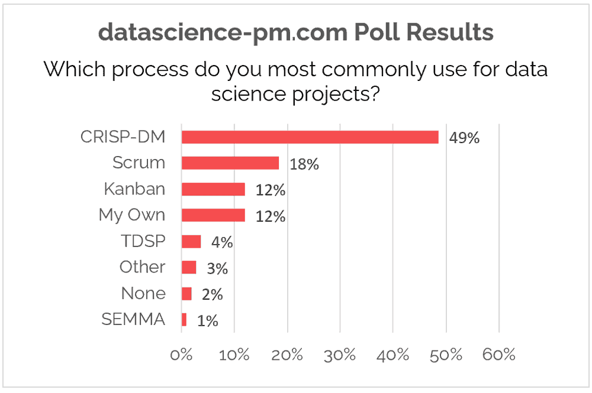
  
  <sup>Fonte: SALTZ, J. CRISP-DM is Still the Most Popular Framework for Executing Data Science Projects. Disponível em: <https://www.datascience-pm.com/crisp-dm-still-most-popular/>.</sup>
  
</div>

&nbsp;&nbsp;&nbsp;&nbsp;Como pode-se notar pelo gráfico anterior, a CRISP-DM apresenta grande destaque entre as metodologias disponíveis, tendo uma diferença de 21 pontos percentuais com a metodologia Scrum, que aparece em segunda posição de preferência.

### 3.3. Fases da metodologia 

&nbsp;&nbsp;&nbsp;&nbsp;Como citado anteriormente, a metodologia CRISP-DM é composta por 6 etapas distintas que abrangem todo os procedimentos necessários para o bom funcionamento de um projeto de dados. 

&nbsp;&nbsp;&nbsp;&nbsp;A sequência de passos para a implementação dessa metodologia estão sintetizados na figura 2:

<div align="center">
  
  <sup>Figura 2 - Esquema de funcionamento de fases CRISP-DM</sup>
  
  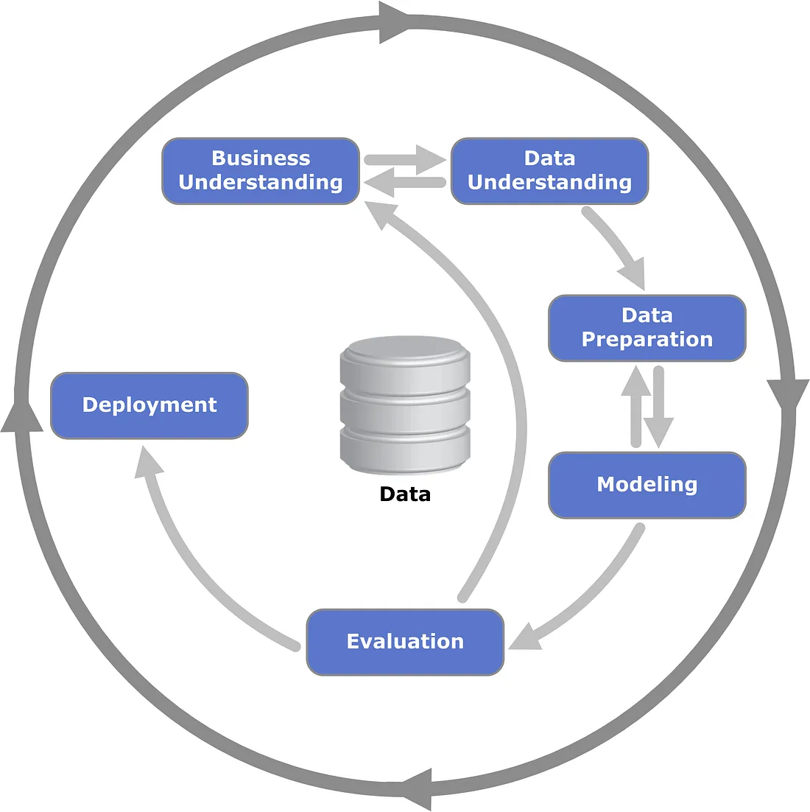
  
  <sup>CHUMBAR, S. The CRISP-DM Process: A Comprehensive Guide. Disponível em: <https://medium.com/@shawn.chumbar/the-crisp-dm-process-a-comprehensive-guide-4d893aecb151>.</sup>

</div>


&nbsp;&nbsp;&nbsp;&nbsp;Cabe destacar, na imagem anterior, a natureza iterativa das fases do CRISP-DM, o que contribui para sua compatibilidade com metodologias ágeis. Nesse sentido, os procedimento citados anteriormente estão listados e descritos a seguir:

**Fase 1: Entendimento de negócio**

&nbsp;&nbsp;&nbsp;&nbsp; Esta etapa consiste na entendimento das necessidades e objetivos que se espera alcançar com o projeto [[6]](#6-referências). Aqui também são compreendidas as regras de negócio específicas, servindo de base para todas as etapas posteriores. Esta etapa é também dividida em 4 subetapas:

1. **Determinação de objetivos de negócio:** Entendimento das necessidades com uma perspectiva de negócio, para então definir critérios de aceite e métricas para sucesso do projeto;
2. **Avaliação inicial:** Avaliações iniciais do projeto, incluem avaliações de riscos, análises de benefícios e avaliação dos recursos disponíveis;
3. **Determinação de metas para os dados:** Elaboração de critérios de sucesso e objetivos que se deseja alcançar do ponto de vista técnico, pensando nos dados e resultados; e
4. **Planejamento do projeto:** Escolha de tecnologias, divisão de etapas e seleção de ferramentas específicas para o projeto.

**Fase 2: Entendimento dos dados**

&nbsp;&nbsp;&nbsp;&nbsp;Esta etapa se dedica ao entendimento dos dados disponíveis para uso, entendendo como eles podem ser utilizados dentro do contexto do projeto, bem como traçar estratégias para coletá-los, caso necessário[[6]](#6-referências). Esta fase também possuiu tarefas específicas, sendo elas:

1. **Coleta inicial de dados**;
2. **Descrição dos dados**;
3. **Exploração dos dados**; e
4. **Verificação de qualidade**.

**Fase 3: Preparação dos dados**

&nbsp;&nbsp;&nbsp;&nbsp;Esta fase diz respeito a preparação dos dados para utilização no projeto, gerando novas coleções de dados. Esta fase pode ser dividida em 5 tarefas:

1. **Seleção dos dados:** Determinar quais coleções de dados serão utilizadas e os porquês dessas escolhas;
2. **Limpeza dos dados:** Remoção de valores inadequados ou que não condizem com a realidade, remoção de partes desnecessárias de código, ajustes nas informações etc.;
3. **Construção de dados:** Elaboração de novos atributos relevantes a partir dos dados iniciais;
4. **Integração dos dados:** Elaboração de novas bases de dados a partir de múltiplas fontes; e
5. **Formatação dos dados:** Ajuste de formato de armazenamento dos dados para forma mais adequada ao projeto.

**Fase 4: Modelagem**

&nbsp;&nbsp;&nbsp;&nbsp;Esta fase está relacionada a testagem de modelos e hipóteses, bem como a realização de análises preliminares sobre a eficácia desses modelos para alcançar os objetivos finais do projeto. As etapas deste momento são:

1. **Seleção de modelos:** Escolher algoritmos e modelos de inteligência artificial para uso no problema;
2. **Padronização de testes:** Determinar os padrões para testagem e avalização da eficácia dos modelos;
3. **Construção do modelo:** Aplicar os modelos selecionados no problema; e
4. **Validação do modelo:** Realizar o teste dos modelos escolhidos, analisando seu desempenho e eficaz na resolução do problema.

**Fase 5: Avaliação**

&nbsp;&nbsp;&nbsp;&nbsp;A fase de avaliação é orientada a determinar quais dos modelos testados e validados na etapa anterior atendem melhor aos objetivos de negócio. As tarefas dessa fase são:

1. **Avaliação de resultado**;
2. **Revisão de processo**; e
3. **Determinação de próximos passos**.

&nbsp;&nbsp;&nbsp;&nbsp;É importante ressaltar que, baseado na natureza iterativa da CRISP-DM, caso seja identificada a necessidade, pode-se retornar a alguma etapa anterior a fim de refazê-la visando o melhor andamento do projeto.

**Fase 6: Lançamento**

&nbsp;&nbsp;&nbsp;&nbsp;Nesta etapa os resultados do projeto são disponibilizados às partes interessadas. Nesse sentido, o andamento dessa fase depende de como se dará o desenvolvimento posterior do projeto, podendo haver uma variação da entrega com bases nos objetivos esperados. Por exemplo, para alguns projetos, um relatório final pode ser suficiente, enquanto para outros pode ser necessária a construção de um aplicação interativa que analisa dados continuamente.

&nbsp;&nbsp;&nbsp;&nbsp;As subetapas desta fase estão descritas a seguir:

1. **Planejamento do lançamento**
2. **Planejamento do acompanhamento e manutenção**
3. **Produção do relatório final e documentação**
4. **Revisão final**

### 3.4. Benefícios esperados e conclusão

&nbsp;&nbsp;&nbsp;&nbsp;Por fim, o correto entendimento do funcionamento da metodologia explorada anteriormente se mostra como um excelente caminho para a construção de um projeto capaz de alcançar os objetivos propostos. Nesse sentido, com a implementação da metodologia CRISP-DM ao projeto em questão, espera-se um processo de desenvolvimento de modelo preditivo melhor estruturado, de modo a maximizar a entrega de valor ao parceiro, minimizando desgastes desnecessários, causados com retrabalho, por exemplo. Com "melhor estruturado", entende-se a gestão de um projeto seguindo metodologias testadas e amplamente validadas no contexto em questão, como se enquadra a CRISP-DM para projetos de dados de modo geral, aumentando as chances de sucesso com bases nos critérios estabelecidos pela equipe.

## <a name="c4"></a>4. Desenvolvimento e Resultados
### 4.1. Compreensão do Problema
#### 4.1.1. Contexto da indústria

&nbsp;&nbsp;&nbsp;&nbsp;Dentro do mercado de modelos preditivos, diversas empresas buscam se especializar no desenvolvimento de inteligências artificiais para diversas finalidades, geralmente relacionadas a demandas empresariais. Atualmente, os dados passaram a ser o ativo mais valioso do mundo, isso fez com que a indústria atual seja dominada por modelos preditivos que buscam gerar estatísticas, das quais podem ser utilizadas para ajudar a tomar decisões importantes em uma empresa, decidir estratégias de mercado, etc. Os modelos preditivos são utilizados majoritariamente por empresas dos setores financeiro, saúde, varejo, logística, marketing e vendas.

&nbsp;&nbsp;&nbsp;&nbsp;A IBM, considerada um dos principais players do mercado de modelos preditivos e inteligências artificias, possui diversos produtos amplamente utilizados no mercado, além de um setor dedicado ao desenvolvimento de modelos preditivos customizados para as necessidades de cada cliente. Dentro dessa área, a IBM possui uma variedade de cases de sucesso, desde o IBM SPSS Modeler, do qual é uma ferramenta de ciência de dados, utilizada para permitir que sua empresa crie seu próprio modelo preditivo através de uma ferramenta no-code e com uma baixa curva de aprendizado, tornando o processo mais rápido e barato, assim como outros produtos, como o IBM Maximo Application Suite, sendo esse um modelo preditivo majoritariamente utilizado em indústrias, visando prever falhas e a necessidade de manutenção dos seus ativos, permitindo que as falhas sejam corrigidas antes mesmo de acontecer, diminuindo prejuízos e aumentando a vida útil dos ativos da empresa.

&nbsp;&nbsp;&nbsp;&nbsp;O mercado de modelos preditivos é amplo e possui diversos players altamente competitivos, composto por grandes empresas de tecnologias, alguns deles são:
  1. **Microsoft:** <br>
      A Microsoft presta serviços relacionados a machine learning e a modelos preditivos, principalmente através da sua plataforma Azure Machine Learning, da qual permite criar modelos preditivos e treiná-los para usos específicos de cada cliente.

  2. **Google Cloud:** <br>
      O Google Cloud é um serviço de nuvem do Google, dentro do leque de serviços do Google Cloud, existe o AutoML, serviço responsável por auxiliar o cliente e criar e treinar o seu próprio modelo preditivo.
      Através do AutoML, é possível suprir demandas específicas da sua empresa, automatização de tarefas, geração de estatísticas que podem ser utilizadas para auxiliar em decisões do cliente.

  3. **AWS - Amazon Web Services:** <br>
      A AWS consiste em um serviço de nuvem da Amazon que possui uma enorme variedade de serviços de tecnologia que visam auxiliar modelos de negócio. No AWS, existe um serviço conhecido por Amazon SageMaker, do qual é utilizado para criar e treinar modelos preditivos que podem ser adequados e treinados individualmente conforme a necessidade dos seus clientes.
      O Amazon SageMaker é amplamente utilizado no mercado para a criação de modelos preditivos personalizados para os mais variados setores.

&nbsp;&nbsp;&nbsp;&nbsp;O mercado de modelos preditivos e inteligência artificial está evoluindo de forma extremamente acelerada, atualmente, as principais tendências de mercado que surgirão nos próximos anos envolvem o uso da hiperconectividade e da internet das coisas para tornar estes modelos mais acessíveis e práticos para o usuário final, além de aumentar as suas capacidades e possibilidades de uso. Também é levado como tendência para este mercado os avanços nos algoritmos de inteligência artificial, aprimorando a sua eficácia e precisão, permitindo resultados mais concisos e confiáveis.

&nbsp;&nbsp;&nbsp;&nbsp;Por fim, é possível concluir que os modelos preditivos são um negócio com crescente demanda e em desenvolvimento constante, mostrando que o mercado está apenas iniciando e ainda possui grande projeção de crescimento. A IBM está presente nesta indústria desde o desenvolvimento primitivo da Deep Blue nos anos 70 até se tornar um dos principais players do mercado atualmente.

#### 4.1.1.1 Cinco Forças de Porter
&nbsp;&nbsp;&nbsp;&nbsp;Inserida em uma indústria, caracterizada pelas rápidas inovações, intensidade competitiva e evolução constante, é necessário que a IBM planeje cada movimento para se destacar entre os concorrentes. Nesse contexto, analisar a empresa através das Cinco Forças de Porter oferece uma ampla visão das dinâmicas competitivas que a empresa enfrenta e auxilia na formulação de estratégias.

&nbsp;&nbsp;&nbsp;&nbsp;As Cinco Forças de Porter são um modelo estratégico desenvolvido por Michel E. Porter em 1979, para fazer uma análise do ambiente competitivo de determinada indústria. Essa ferramenta se destaca não apenas para formular estratégias em uma empresa, mas também para a tomada de decisões. Para obter uma análise completa, as forças de Porter se dividem em ameaça de entrada de novos concorrentes, ameaça de produtos substitutos, poder de negociação dos clientes, poder de negociação dos fornecedores e rivalidade entre os concorrentes [[7]](#6-referências).

&nbsp;&nbsp;&nbsp;&nbsp;Utilizando esses conceitos, é possível aplicar a estrutura das 5 Forças de Porter à IBM para avaliar sua posição competitiva e identificar os principais impulsionadores de lucratividade e os desafios enfrentados pela empresa.

<div align="center">
  
  <sup>Figura 1 - Cinco Forças de Porter </sup>
  
  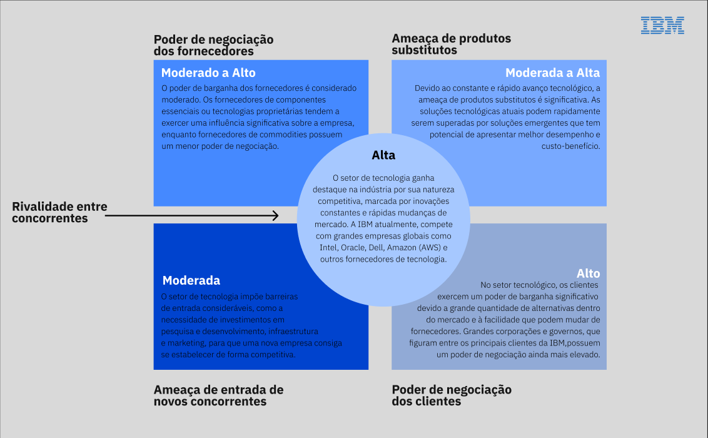
  
  <sup>Fonte: Material produzido pelos autores (2024)</sup>
  
</div>

1. **Rivalidade entre Concorrentes**: O setor de tecnologia ganha destaque na indústria por sua extrema rivalidade, intensificada pelas rápidas inovações tecnológicas e uma demanda constante por novos produtos e serviços no mercado. A IBM compete atualmente com grandes empresas globais como Intel, Oracle, Dell, Amazon (AWS) e outros fornecedores de tecnologia. Para manter sua posição no mercado, a IBM precisa investir continuamente em inovação e diversificação de seus produtos. A empresa tem concentrado seu foco em áreas emergentes, como inteligência artificial e computação quântica, buscando destaque e liderança na tecnologia. A aquisição da Red Hat em 2019 foi uma jogada estratégica para fortalecer a presença da IBM no mercado de nuvem híbrida.
2. **Poder de Barganha dos Fornecedores**: No setor de tecnologia, o poder de barganha dos fornecedores é considerado moderado, variando dependendo do produto ou serviço fornecido. Os fornecedores de componentes essenciais ou tecnologias proprietárias tendem a exercer uma influência significativa sobre a empresa, enquanto fornecedores de commodities possuem um menor poder de negociação. Devido ao seu porte e relevância no mercado, a IBM se encontra em uma posição relativamente forte para negociar com seus fornecedores. Como parte de sua estratégia para mitigar riscos, a IBM implementou uma diversificação desses fornecedores.
    
    Essa estratégia é particularmente evidente na fabricação de chips, onde a corporação colabora com empresas de semicondutores, como GlobalFoundries e Samsung. Ao trabalhar com múltiplos fornecedores, a IBM reduz a dependência de um único parceiro, garantindo a continuidade da produção e minimizando os riscos de possíveis interrupções na cadeia de suprimentos. Essa diversificação assegura sua capacidade de inovação e competitividade no mercado.
    
3. **Ameaça de Produtos Substitutos**: Devido ao constante e rápido avanço tecnológico, a ameaça de produtos substitutos é significativa. As soluções tecnológicas atuais podem ser rapidamente superadas por soluções emergentes que têm potencial de apresentar melhor desempenho e custo-benefício. Para conter essa ameaça, a IBM destina, em média, cerca de $ 6,5 bilhões para pesquisa e desenvolvimento, com foco em áreas como computação quântica, inteligência artificial e segurança cibernética. Essa estratégia faz com que a IBM se destaque por ser uma das poucas empresas de TI que se mantém em consistência econômica e de desenvolvimento[[8]](#6-referências). Ao investir em áreas emergentes, a IBM consegue se posicionar estrategicamente para liderar novas inovações.
4. **Ameaça de Novos Entrantes**: O setor de tecnologia impõe barreiras de entrada consideráveis, como a necessidade de investimentos em pesquisa e desenvolvimento, infraestrutura e marketing, para uma nova empresa conseguir se estabelecer competitivamente. No entanto, startups com modelos de negócio disruptivos podem representar um desafio para as empresas já consolidadas no mercado. Para mitigar esses riscos, a IBM mantém uma vigilância constante do mercado, identificando startups com potencial de introduzir inovações tecnológicas e avaliando a viabilidade de parcerias ou aquisições para neutralizar possíveis ameaças emergentes.
    
    A compra da SoftLayer em 2012, que se tornou a base para a IBM Cloud, é um exemplo dessa estratégia. Além disso, o programa “Startup with IBM” oferece créditos de nuvem e apoio técnico para startups, auxiliando a IBM a estabelecer parcerias vantajosas com empresas promissoras desde o início. Essa abordagem reduz a ameaça de novos entrantes e impulsiona a inovação.
    
5. **Poder de Barganha dos Clientes**: No setor tecnológico, os clientes exercem um poder de barganha elevado devido à abundância de alternativas no mercado e à facilidade com que podem mudar de fornecedores. Grandes corporações e governos, que figuram entre os principais clientes da IBM, possuem um poder de negociação ainda mais elevado. Para garantir a retenção desses clientes, a IBM deve se concentrar em oferecer valor diferenciado e soluções personalizadas, além de investir em relacionamentos de longo prazo para aumentar a fidelidade e a satisfação dos seus clientes. O IBM Managed Services, por exemplo, fornece gestão contínua e suporte técnico, podendo fortalecer a relação com os clientes, criando barreiras significativas para a troca de fornecedores.

&nbsp;&nbsp;&nbsp;&nbsp;A análise das Cinco Forças de Porter evidencia que a IBM atua em um ambiente extremamente competitivo e dinâmico. A intensa rivalidade entre concorrentes, somada à ameaça de novos entrantes e produtos substitutos, além do poder de barganha tanto dos fornecedores quanto dos clientes, impõe à IBM a necessidade de um foco contínuo em inovação, qualidade e excelência no atendimento. Ao seguir investindo em tecnologias emergentes e ajustando suas estratégias de mercado, a IBM tem o potencial de manter sua posição de liderança e sustentar seu crescimento no setor tecnológico.

#### 4.1.2. Análise SWOT 
&nbsp;&nbsp;&nbsp;&nbsp;A Análise SWOT serve como uma ferramenta para visualizar a situação da empresa a partir de diferentes perspectivas. Essa análise é realizada tanto a partir de uma perspectiva interna quanto externa. A análise interna foca nas forças e fraquezas da empresa, enquanto a análise externa se concentra nas oportunidades e ameaças presentes no ambiente de mercado. O objetivo da Análise SWOT é ajudar a empresa a desenvolver um plano estratégico, considerando o contexto do mercado. Dado este fato, foi elaborada uma Análise conforme representado pela Figura 1.

<div align="center">
  
  <sup>Figura 2 - Análise SWOT<sup>
  
  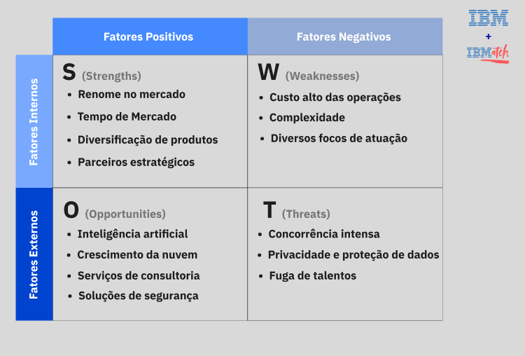
  
  <sup>Fonte: Material produzido pelos autores (2024)<sup>

</div>

&nbsp;&nbsp;&nbsp;&nbsp;Como visto acima na Figura 1, a Análise SWOT da IBM oferece uma visão abrangente dos principais fatores que influenciam e explicam a posição da empresa no mercado. Esta análise é dividida em quatro categorias principais: Forças, Fraquezas, Oportunidades e Ameaças, que são detalhadas a seguir.

**Forças (*Strengths*):**
- **Renome no mercado:** A IBM é internacionalmente reconhecida, ela possui uma longa história de confiabilidade e segurança desde o início da sua formação. 
- **Tempo no mercado:** A empresa tem mais de 100 anos de atuação, ao longo deles, construiu uma excelente reputação, o que a faz ter um nome sólido no mercado.
- **Diversificação de produtos:** A IBM tem diversos produtos, desde consultoria especializada, como a *[IBM Consulting Cybersecurity Services](https://www.ibm.com/br-pt/services/security)* até soluções de automações empresariais, fornecendo assim uma grande gama de produtos, podendo atender diversos clientes diferente
- **Parceiros estratégicos:** Ao longo de seus diversos anos no mercado, a IBM criou muitas parcerias estratégicas com grandes empresas, como a Microsoft. 	O que a faz ter ainda mais respeito no mercado.

**Fraquezas (*Weaknesses*):**
- **Custo Alto de Operação:** Os custos operacionais são altos, já que são grandes processos desenvolvidos por diversos funcionários, isso pode limitar a competitividade da IBM em termos de preço em comparação a outras empresas do ramo.
- **Complexidade:** Os produtos e serviços da IBM podem ser vistos como complexos e caros para empresas médias e pequenas, que por muitas vezes querem soluções simples e rápidas. 
- **Diversos focos de atuação:** A IBM tem um portfólio de negócios muito diversificado, o que pode gerar uma dificuldade para  manter o foco e a excelência em todas as áreas de atuação.

**Oportunidades(*Opportunities*):**
- **Inteligência artificial:** Com a crescente demanda pela Inteligência Artificial, a IBM tem uma grande oportunidade de atuar com um grande fornecedor dessa necessidade.
- **Crescimento da Nuvem:** A procura por serviços de armazenamento em nuvem criam uma oportunidade para a IBM conseguir expandir o [*IBM Cloud*](https://www.ibm.com/br-pt/cloud?utm_content=SRCWW&p1=Search&p4=43700078882422040&p5=e&p9=58700008628455310&gclid=Cj0KCQjwq_G1BhCSARIsACc7NxooWGlnYILLw3KKq8vSx9S9iiYeiniuuPaklTaNFMB2aRpyvKbqHrAaAkB-EALw_wcB&gclsrc=aw.ds).
- **Serviços de Consultoria:** Cada vez mais empresas buscam uma migração para o digital com segurança, a IBM pode oferecer uma consultoria para auxiliar nessa transformação ou extensão para o ambiente virtual.
- **Soluções de Segurança:** Com a criação de leis sobre a proteção de dados, as empresas agora têm uma necessidade maior de cibersegurança, para evitarem  vazamento desses dados.

**Ameaças (*Threats*):**
- **Ciclos de Inovação:** No setor de tecnologia, os ciclos de inovação se tornam cada vez mais curtos. Pelo tamanho da IBM, companhar essas mudanças rápidas podem levar um tempo que seria importante para uma maior presença no mercado.
- **Privacidade e Proteção de Dados:** violações de dados e problemas de privacidade podem afetar diretamente a reputação da IBM.
- **Fuga de Talentos:** A intensa competição por talentos na área de tecnologia pode criar uma perda de mão de obra qualificada para concorrentes, como, Amazon, Google e Microsoft, o que pode impactar a capacidade da IBM de inovar e entregar soluções com qualidade.


&nbsp;&nbsp;&nbsp;&nbsp;Dessa forma, por meio da elaboração da Análise SWOT, a equipe conseguiu identificar de maneira diversificada e detalhada os pontos fortes, as fraquezas, as oportunidades e as ameaças relacionadas à IBM, considerando tanto sua longa história de renome e parcerias estratégicas quanto os desafios impostos pela complexidade de seus produtos e os ciclos rápidos de inovação no setor de tecnologia. Portanto, essa análise serve como uma ferramenta para a criação de estratégias que reduzam as fraquezas e ameaças, ao mesmo tempo que explorem as forças e oportunidades, como a inteligência artificial e o crescimento da nuvem.

<br>

#### 4.1.3. Planejamento Geral da Solução
Através dos dados disponibilizados pelo parceiro, buscamos trazer uma solução para a análise de desempenho de times de futebol, com o objetivo de ajudar a IBM em vender seus produtos de inteligência artificial e dados utilizando nosso modelo como vitrine para seus futuros clientes. Atualmente temos dados sobre os resultados das partidas de futebol, desempenho de times e jogadores do campeonamento Brasileirão 2024. 

A solução proposta consiste em um modelo preditivo que analisa o desempenho de times e jogadores para prever os resultados de partidas futuras. Utilizaremos de algoritmos de classificação, os quais são capazes de classificar os resultados das partidas a partir de dados históricos sobre os time. 

Com nosso produto será possível gerar relatórios analíticos sobre o desempenho dos times, auxiliando o parceiro a tomar decisões estratégicas e a mensurar o retorno sobre investimento de campanhas publicitárias no cenário. 

Os benefícios trazidos pela solução proposta incluem a geração de relatórios analíticos para os investidores de clubes, a criação ágil e assertiva de estratégias de marketing e financeiras, a emissão simplificada de métricas e resultados dos times e a visualização simples de dados. 

Por fim, o critério de sucesso da solução proposta é a precisão e assertividade do modelo nas predições, que será calculada através de métricas de desempenho de modelos preditivos, tais como recall, precision, f1-score, MSE, acurácia entre outras que se mostrem relevantes. Dessa maneira, espera-se a resolução da problemática trazida pelos parceiros de projeto, construindo modelos capazes de descrever de maneira confiável o comportamento de partidas de futebol e predizer seus resultados.

#### 4.1.4. Value Proposition Canvas

&nbsp;&nbsp;&nbsp;&nbsp;Tão importante quanto entender o negócios é estudar se nossa solução tera adesão e tração no mercado que estamos entrando. Entender as dores de nossos clientes e encontrar como nossa solução pode ajuda-lo é um passo importante rumo a construção de um produto sólido.

&nbsp;&nbsp;&nbsp;&nbsp;A proposta de valor dentro do Modelo de Negócios Canvas é uma ferramenta para entender se um produto ou serviço terá aderência do mercado. Ou seja, o objetivo é compreender se uma vez que uma empresa iniciar suas atividades, ela vai encontrar clientes querendo consumir o seu produto ou serviço [[9]](#6-referências). 


<div align='center'>
    
  <sup>Figura 3 - Value Proposition Canvas</sup>
  
  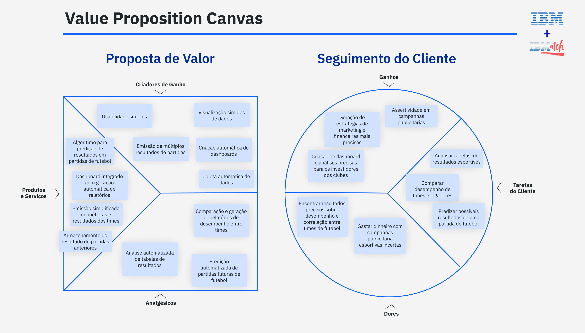
  
  <sup>Fonte: Material produzido pelos autores (2024)</sup>

</div>

#### Segmento de Cliente
   
&nbsp;&nbsp;&nbsp;&nbsp;O segmento de cliente visa entender melhor as dores e necessidades do cliente para uma melhor construção do nosso produto ou serviço final.

**Dores do Cliente**
  
> Também chamadas de Pain Points, são todas as dores antes, durante ou depois dos trabalhos realizados [[10]](#6-referências).

&nbsp;&nbsp;&nbsp;&nbsp; Para formulação da solução, foram identificados:

1. Dificuldade em encontrar resultados precisos sobre o desempenho de um time e sua correlação com outros.

2. Dificuldade em mensurar o retorno sobre investimento de campanhas publicitárias em futebol

**Tarefas do Cliente:**

> Descrevem as ações que as pessoam executam no seu trabalho ou na sua vida pessoal [[10]](#6-referências).

&nbsp;&nbsp;&nbsp;&nbsp; Para formulação da solução, foram identificados:

1. Analisar tabelas de resultados esportivos.

2. Comparar desempenho de times e jogadores.

3. Predizer possíveis resultados de uma partida de futebol.

**Ganhos:**

> Descrevem os resultados ou benefícios esperados na execução das ações [[10]](#6-referências).

&nbsp;&nbsp;&nbsp;&nbsp; Para formulação da solução, foram identificados:

1. Maior facilidade ao mensurar retorno de campanhas esportivas.

2. Criação ágil e assertiva de estratégias de marketing e financeiras.

3. Geração de relatórios analíticos para os investidores de clubes.

#### Proposta de Valor

**Analgésicos:**

> Descrevem quais dores e de que forma são aliviadas através dos produtos ou serviços ofertados [[10]](#6-referências).

&nbsp;&nbsp;&nbsp;&nbsp;No planejamento da solução, foram elaborados:

1. Comparação e geração de relatórios de desempenho entre times.

2. Análise automatizada de tabelas de resultados.

3. Predição automatizada de partidas futuras de futebol.

**Criadores de Ganho:**

> Descrevem quais os resultados obtidos e benefícios aos usuários através da utilização dos produtos e serviços [[10]](#6-referências).

&nbsp;&nbsp;&nbsp;&nbsp;No planejamento da solução, foram elaborados:

1. Visualização simples de dados.

2. Usabilidade simples.
  
3. Emissão de múltiplos resultados de partidas.
  
4. Criação automática de dashboards.
  
5. Coleta automática de dados.

**Produtos e Serviços:**

> São todos os produtos ou serviços ofericidos que auxiliam os usuários a executarem seus trabalhos... [[10]](#6-referências)

&nbsp;&nbsp;&nbsp;&nbsp;No planejamento da solução, foram elaborados:

1. **Algoritmo para predição de resultados em partidas de futebol.**
    
    O produto atua gerando análises muito mais precisas, usando um algoritmo próprio que calcula os resultados baseados em partidas anteriores.


2. **Dashboard integrado com geração automática de relatórios.**
    
    Um dashboard integrado ao algoritmo facilita a visualização e coletas de dados, gerando mais insights e auxiliando diretamente em estratégias de marketing.

3. **Emissão simplificada de métricas e resultados dos times.**
    
    A emissão de métricas auxilia os times na hora de conversar com os investidores, trazendo insumos que podem ser usados durante reuniões ou em análises mensais.

4. **Armazenamento do resultado de partidas anteriores.**
    
    O armazenamentos dos dados gerados pode auxiliar o time a traçar e comparar o desempenho com meses anteriores. Isso auxilia na criação de estratégias entendendo os momentos em que os times estiveram nos seus auges.


#### 4.1.5. Matriz de Riscos

&nbsp;&nbsp;&nbsp;&nbsp;A Matriz de Risco consiste em um recurso usado no desenvolvimento de projetos para identificar e gerenciar ameaças e oportunidades que possam surgir ao longo do processo de desenvolvimento. Essa ferramenta funciona relacionando a probabilidade de determinado evento ocorrer com o impacto que essa ocorrência teria para o projeto, permitindo uma visão geral dessas situações, sejam elas positivas ou negativas [[11]](#6-referências). 

&nbsp;&nbsp;&nbsp;&nbsp;Além disso, sua forte relação com os riscos de determinada iniciativa tornam a matriz de risco uma excelente ferramenta para ser usada em conjunto com outras análises de cenário, como a [Análise SWOT](https://asana.com/pt/resources/swot-analysis), possibilitando mensurar e explorar mais detalhadamente alguns dos tópicos abordados nessas outras análises [[12]](#6-referências).

&nbsp;&nbsp;&nbsp;&nbsp;A Matriz de Risco permite, também, que sejam traçadas iniciativas e ações para a contenção de ameaças (ou aproveitamento de oportunidades), bem como identificar quais devem ser priorizados e quais se deve ter maior atenção ao longo do ciclo de vida do projeto. Cabe ressaltar, ainda, a natureza mutável dos riscos de um projeto e, por conseguinte, da Matriz de Riscos, a qual exige constante atualização e acompanhamento dos riscos identificados para que seja possível agir efetivamente sobre eles [[13]](#6-referências).

&nbsp;&nbsp;&nbsp;&nbsp;Partindo desses arcabouço teórico e reconhecendo a importância dessa ferramenta no desenvolvimento do [nosso projeto de análise preditiva](#22-proposta-de-solução), elaborou-se uma matriz de risco, apresentada na Figura N, juntamente com uma legenda para sua leitura, exposta no Quadro N:

<div align="center">
  
  <sup>Figura 4 - Matriz de risco</sup>
  
  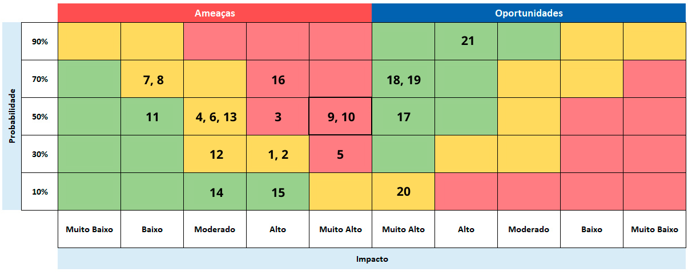
  
  <sup>Fonte: Material produzido pelos autores (2024)</sup>
  
</div>

&nbsp;&nbsp;&nbsp;&nbsp;Como citado anteriormente, construiu-se no Quadro 1 uma legenda para a matriz acima, no qual cada um dos número diz respeito a um número na matriz e descreve cada uma das ameaças identificados no projeto:

<div align="center">
<sup>Quadro 1 - Legenda da matriz de risco: ameaças</sup>

Numeração|Descrição do risco|
---|---|
1  | Desvio de escopo. (Ocorre quando o escopo não está bem definido, levando a elaboração de uma solução que foge do esperado ou não atende a expectativas).
2  | Compreensão equivocada do projeto ou problema.
3  | Uso inadequado dos dados disponíveis.
4  | Dados inadequados para uso.
5  | Usos dos dados em desconformidade à LGPD.
6  | Falta de comunicação efetiva na equipe.
7  | Tratamento inadequado dos dados.
8  | Estruturas para armazenamento de dados inadequada.
9  | Negligência na segurança dos dados.
10 | Violação da privacidade do usuário.
11 | Validação ineficiente da solução.
12 | Perdas de informações.
13 | Manutenção de vieses na solução.
14 | Conflitos de objetivos.
15 | Falta de planejamento na elaboração da solução.
16 | Overfitting/underfitting dos dados

<sup>Fonte: Material produzido pelos autores (2024)</sup>
</div>

&nbsp;&nbsp;&nbsp;&nbsp;Ademais, fez-se também, no Quadro 2, uma legenda para a matriz indicando a oportunidades do projeto:

<div align="center">
<sup>Quadro 2 - Legenda da matriz de risco: oportunidades</sup>

Numeração|Descrição do risco|
---|---|
17 | Extensão do projeto para previsão de partidas de futebol de campeonatos fora do Brasil
18 | Utilização da solução como maneira de calcular o desempenho geral de clubes
19 | Utilização da solução como maneira de calcular o desempenho geral de atletas
20 |Implementação de séries temporais para análises em tempo real do jogo
21 | Utilização da solução para consultorias privadas de times 

<sup>Fonte: Material produzido pelos autores (2024)</sup>
</div>

&nbsp;&nbsp;&nbsp;&nbsp;Por fim, também nos utilizando dos conceitos explorados no início da seção, construiu-se um breve plano de mitigação para cada uma das ameaças identificadas, respectivamente numeradas conforme o quadro anterior e descritas no Quadro 3:

<div align="center">
<sup>Quadro 3 - Tabela de mitigação de ameaças</sup>

Ameaça |Ação de mitigação|
---|---|
1  | Seguir os planos de entrega em consonância com as limitações impostas pelo tempo e planejamento do projeto.
2  | Leitura do TAPI juntamente com trocas constantes com o parceiro e PO para adequações no andamento da solução.
3  | Validação sobre utilização dos dados disponíveis na elaboração e treinamento do modelo, com testagens constantes para averiguar o impacto das informações usadas no resultado final.
4  | Limpeza, preparação e adequação dos dados para uso dentro do projeto. Caso, mesmo com as etapas anteriores, as informações permaneçam inadequadas para uso, solicitar novas bases de dados para a continuidade do projeto.
5  | Validações juntamente ao PO e professores instrutores sobre o uso das informações. Caso necessário, validação do uso com equipe especializada.
6  | Ênfase na utilização dos rituais Scrum para manutenção de comunicação entre a equipe, bem como técnicas como a Comunicação Não-Violenta.
7  | Validação sobre o tratamento realizado nos dados juntamente ao parceiro e PO. Caso o tratamento feito seja considerado inadequado, haverá uma tentativa de melhorá-lo e, caso essa ação não surta o efeito esperado, o ajuste das informações deverá recomeçar.
8  | Utilização de outras estruturas de dados e/ou formatos de arquivo que facilitem a leitura, análise e manipulação da informação.
9  | Cuidado na manipulação dos dados para evitar vulnerabilidades. Dentre as ações para evitar esse risco, contam a não disponibilização das informações em sites, fóruns ou serviços de inteligência artificial não autorizados.
10 | Não utilização de dados sensíveis ou que sejam considerados irrelevantes para as análises almejadas ou que não tenham sido previamente acordadas com o usuário.
11 | Execução de um processo de validação, com testes de segurança, confiabilidade, e testes junto ao parceiro de projeto.
12 | Cuidado no armazenamento e manipulação dos dados, com utilização de ferramentas de backup, como o próprio github da equipe, para que não haja perdas de dados. O uso de técnicas de backup deve estar em conformidade com as ações estabelecidas anteriormente em relação a segurança das informações e privacidade do usuário.
13 | Processo de validação com terceiros para a identificação de vieses na equipe que possam afetar a performance ou eficácia do projeto, bem como realização de alterações para contornar esses vieses.
14 | Alinhamento da equipe com o parceiro de projetos para que todos possam caminhar rumo a um objetivo comum, evitando conflitos de interesses.
15 | Realização de rituais scrum, como elaboração de product backlog, sprint backlog, sprint review e sprint retrospective, para planejamento e validação do desenvolvimento da solução.
16 | Documentação de testes e treinamentos para análises e ajustes. 

<sup>Fonte: Material produzido pelos autores (2024)</sup>
</div>

&nbsp;&nbsp;&nbsp;&nbsp;Da mesma maneira, formulou-se um breve plano de mitigação para cada uma das ameaças identificadas, respectivamente numeradas conforme o quadro anterior e descritas no Quadro 4:

<div align="center">
<sup>Quadro 4 - Tabela de aproveitamento de oportunidades</sup>

Ameaça |Ação de aproveitamento|
---|---|
17 | Divulgação da solução dentro do meio esportivo/corporativo,com o objetivo de alcançar novos espaços, além do treinamento do modelo com dados de times de fora do Brasil.
18 | Elaboração de um sistema robusto de classificação, bem como desenvolver uma maneira de armazenar essas métricas em momentos posteriores, permitindo uma maneira unificada de avaliar o desempenho do clube.
19 | Elaboração de um sistema robusto de classificação, bem como desenvolver uma maneira de armazenar essas métricas em momentos posteriores, permitindo uma maneira unificada de avaliar o desempenho do jogador.
20 | Realização de estudos complementares para a adaptação do modelo para coleta de dados em tempo real, permitindo que as estatísticas sejam constantemente atualizadas ao decorrer do jogo.
21 | Estabelecer parcerias com times e instituições ligadas ao futebol para a utilização da solução para seus usos particulares. As parcerias seriam conseguidas através da IBM por meio de campanhas de marketing e divulgação de atuais parceiros da empresa.

<sup>Fonte: Material produzido pelos autores (2024)</sup>
</div>

&nbsp;&nbsp;&nbsp;&nbsp; Todas as informações anteriormente citadas estão agrupadas na planilha disponibilizada no [Anexo A](#anexos).

&nbsp;&nbsp;&nbsp;&nbsp;Dessa maneira, foram elaboradas a Matriz de Risco e um plano de contenção de ameaças para o projeto. Essa etapa foi de extrema importancia ao trazer uma visão mais ampla de ameaças que poderiam surgir durante o desenvolvimento da solução e como a equipe pode lidar com elas, evitando maiores problemas enquanto podemos aproveitar melhor das oportunidades também mapeadas. Com isso, espera-se, levando em consideração as previsões e planos feitos anteriormente, uma construção de projeto mais assertiva e controlada, potencializando a entrega de valor da solução.

#### 4.1.6. Personas
&nbsp;&nbsp;&nbsp;&nbsp;Nesta seção, serão apresentadas as personas relacionadas ao projeto, representadas nas figuras 5, 6 e 7. As personas são representações fictícias dos futuros usuários e são importantes para auxiliar no desenvolvimento da solução, garantindo que as escolhas e decisões em relação ao projeto atendam às reais expectativas e necessidades dos usuários.

&nbsp;&nbsp;&nbsp;&nbsp;Entender as necessidades das personas permite que a equipe foque em criar uma experiência de usuário que não apenas atenda aos requisitos técnicos, mas que também esteja alinhada com os objetivos e desejos dos usuários. As figuras abaixo representam diferentes perfis de usuários, cada um com suas próprias metas, dores e necessidades [[14]](#6-referências).

&nbsp;&nbsp;&nbsp;&nbsp;A persona a seguir (Figura 5) refere-se ao Proprietario de uma grande fazenda, como dono do negócio, Cláudio é responsável por tomar decisões importantes, ele representa um potencial investidor.

<div align="center">
  
  <sup>Figura 5 - Persona do fazendeiro</sup>
  
  
  
  <sup>Fonte: Material produzido pelos autores (2024)</sup>
  
</div>

&nbsp;&nbsp;&nbsp;&nbsp;A persona a seguir (Figura 6) refere-se ao administrador da aplicação, ou seja, representa o funcionário da IBM que administrará a aplicação, dando e revogando acessos e atualizando os dados para manter a precisão do modelo preditivo.

<div align="center">
  
  <sup>Figura 6 - Persona Administrador</sup>
  
  
  
  <sup>Fonte: Material produzido pelos autores (2024)</sup>
  
</div>
  
&nbsp;&nbsp;&nbsp;&nbsp;A persona a seguir (Figura 7) refere-se ao técnico de futebol André, que representa um treinador inovador e comprometido com o desempenho de sua equipe.

<div align="center">
  
  <sup> Figura 7 - Persona Técnico de Futebol</sup>
  
  
  
  <sup>Fonte: Material produzido pelos autores (2024)</sup>
  
</div>

&nbsp;&nbsp;&nbsp;&nbsp;Com base nas informações apresentadas, a equipe agora pode identificar claramente quem serão os principais usuários da solução. Isso permite entender suas necessidades, expectativas e desafios, direcionando os esforços de maneira mais precisa. Com esse conhecimento, a equipe pode criar uma solução que não apenas atenda as necessidades técnicas, mas que também seja intuitiva e focada nos os desejos e necessidades dos usuários, aumentando a chance de sucesso do projeto.

#### 4.1.7. Jornadas do Usuário
&nbsp;&nbsp;&nbsp;&nbsp; O mapa da jornada do usuário, apresentado na figura 8, é uma ferramenta que serve para auxiliar a compreender todas as etapas que o usuário percorre até a realização do seu objetivo final. Ele tem a capacidade de mostrar as decisões tomadas pelo usuário ao longo do processo, permitindo que a equipe e a empresa tenham uma visão dos motivos, pensamentos e sentimentos envolvidos em cada fase da jornada. [[15]](#6-referências) Ao mapear essas experiências, a empresa pode identificar que áreas como o atendimento e a experiência do cliente podem ser aprimoradas, por exemplo, além de visualizar novas oportunidades de crescimento e inovação. Essa ferramenta ajuda a alinhar as estratégias de negócio com as necessidades e expectativas dos usuários, garantindo uma abordagem mais personalizada e eficaz.

&nbsp;&nbsp;&nbsp;&nbsp;No cenário representado na figura 8, é detalhado o caminho que a Persona percorre até contratar e instalar um modelo preditivo em suas plantações. Cláudio, um fazendeiro que sofre com pragas e mudanças climáticas, lida com um cenário delicado em sua fazenda. Em busca de uma solução para superar essas dificuldades, ele decide investir em uma tecnologia que possa trazer previsibilidade e estabilidade à sua produção.

&nbsp;&nbsp;&nbsp;&nbsp;A jornada do usuário foi desenvolvida pensando na persona Cláudio, pois ele representa um dos principais ou potenciais clientes. O objetivo do projeto é ser um produto que será apresentado no camarote da IBM, para que o potencial cliente tenha a oportunidade de conhecer e avaliar o produto. Como se trata de um modelo preditivo de futebol, ele fará previsões sobre as partidas. A expectativa é que, ao observar as métricas e os resultados obtidos pelo modelo, Cláudio sinta confiança no produto. A ideia é que, com essa confiança gerada, o cliente se sinta confortável para adquirir um produto da IBM. O modelo preditivo desenvolvido pela equipe será usado como portfólio.

<div align="center">
  
  <sup>Figura 8 - Mapa da Jornada do usuário</sup>
  
  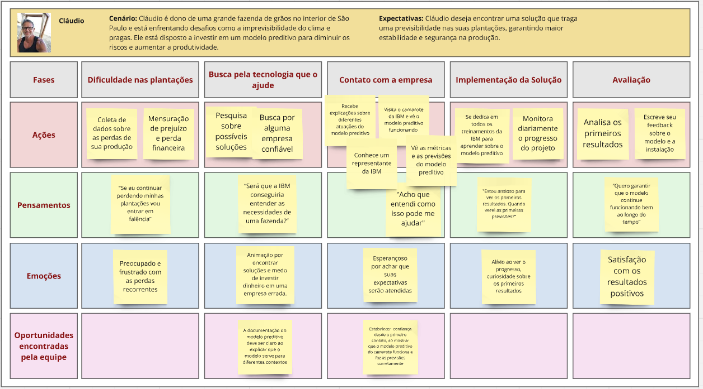
  
  <sup>Fonte: Material produzido pelos autores (2024)</sup>
  
</div>

&nbsp;&nbsp;&nbsp;&nbsp;Com base nas informações apresentadas na figura 8, a equipe identificou que, ao longo da jornada do usuário, as emoções de Cláudio passam de preocupação para satisfação à medida que ele compreende melhor o que seria um modelo preditivo. Isso demonstra a importância do modelo preditivo desenvolvido, que será apresentado no camarote da IBM, pois ele será capaz de gerar confiança e compreensão. Para isso, o projeto precisa apresentar métricas. O cliente deve perceber que o modelo preditivo funciona com segurança em suas previsões. Além disso, a demonstração prática e visual do modelo no camarote deve ser simples de entender, explicando claramente quais são as diferentes previsões e como se aplicam naquele cenário da partida de futebol, garantindo que o cliente veja o valor e a aplicabilidade do produto. No camarote, tambem é necessário que o representante da IBM, que está acompanhando esse cliente, deixe claro que o modelo preditivo pode ser aplicado em diferentes cenários, como na fazenda de Cláudio.

#### 4.1.8 Política de Privacidade

&nbsp;&nbsp;&nbsp;&nbsp;Conforme instruções fornecidas por professores, segue a Política de Privacidade da solução, documento que regirá o uso que faremos dos dados fornecidos pela empresa parceira:

> Última atualização: Aug 2024.
> 
> Política de Privacidade
>
> A IBM, pessoa jurídica de direito privado, com sede na Rua Tutóia, 1157 - Vila Mariana São Paulo, SP 04007-900 Brasil, inscrita no CNPJ/MF sob o nº 07.127.471/0001-04 (“Controlador” ou “nós”) leva a sua privacidade a sério e zela pela segurança e proteção de dados de todos os seus clientes, parceiros, fornecedores e usuários (“Usuários” ou “você”).
>
> Esta Política de Privacidade (“Política de Privacidade”) destina-se a informá-lo sobre o modo como nós utilizamos e divulgamos informações coletadas em nossos canais e através de terceiros, a exemplo a Footystats.
>
> AO ACESSAR O MODELO PREDITIVO (“SERVIÇO”, “SOLUÇÃO” ou “PRODUTO”), ENVIAR INFORMAÇÕES OU FORNECER QUALQUER TIPO DE DADO PESSOAL, VOCÊ DECLARA ESTAR CIENTE E DE ACORDO COM ESTA POLÍTICA DE PRIVACIDADE, A QUAL DESCREVE AS FINALIDADES E FORMAS DE TRATAMENTO DE SEUS DADOS PESSOAIS QUE VOCÊ DISPONIBILIZAR NO SERVIÇO.
> 
> Esta Política de Privacidade fornece uma visão geral de nossas práticas de privacidade e das escolhas que você pode fazer, bem como direitos que você pode exercer em relação aos Dados Pessoais tratados por nós. Se você tiver alguma dúvida sobre o uso de Dados Pessoais, entre em contato com privacidade@ibm.com.
>
> Além disso, a Política de Privacidade não se aplica a quaisquer aplicativos, produtos, serviços, site ou recursos de mídia social de terceiros que possam ser oferecidos ou acessados por meio do modelo preditivo. O acesso a esses links fará com que você deixe o produto e possa resultar na coleta ou compartilhamento de informações sobre você por terceiros. Nós não controlamos, endossamos ou fazemos quaisquer representações sobre esses sites de terceiros ou suas práticas de privacidade, que podem ser diferentes das nossas. Recomendamos que você revise a política de privacidade de qualquer site com o qual você interaja antes de permitir a coleta e o uso de seus Dados Pessoais.
> 
> Caso você nos envie Dados Pessoais referentes a outras pessoas físicas, você declara ter a competência para fazê-lo e declara ter obtido o consentimento necessário para autorizar o uso de tais informações nos termos desta Política de Privacidade.
> 
> Definições
>
> Para os fins desta Política de Privacidade:
>
>“Dados Pessoais” significa qualquer informação que, direta ou indiretamente, identifique ou possa identificar uma pessoa natural, como por exemplo, nome, CPF, data de nascimento, endereço IP, dentre outros;
>
> “Dados Pessoais Sensíveis” significa qualquer informação que revele, em relação a uma pessoa natural, origem racial ou étnica, convicção religiosa, opinião política, filiação a sindicato ou a organização de caráter religioso, filosófico ou político, dado referente à saúde ou à vida sexual, dado genético ou biométrico;
>
> “Tratamento de Dados Pessoais” significa qualquer operação efetuada no âmbito dos Dados Pessoais, por meio de meios automáticos ou não, tal como a recolha, gravação, organização, estruturação, armazenamento, adaptação ou alteração, recuperação, consulta, utilização, divulgação por transmissão, disseminação ou, alternativamente, disponibilização, harmonização ou associação, restrição, eliminação ou destruição. Também é considerado Tratamento de Dados Pessoais qualquer outra operação prevista nos termos da legislação aplicável;
> 
> “Leis de Proteção de Dados” significa todas as disposições legais que regulem o Tratamento de Dados Pessoais, incluindo, porém sem se limitar, a Lei nº 13.709/18, Lei Geral de Proteção de Dados Pessoais (“LGPD”).
> Uso de Dados Pessoais
>
> Coletamos e usamos Dados Pessoais para analisar acontecimentos de partidas esportivas e melhorar a compreensão da interação de diferentes fatores nos resultados desses eventos. Exemplos de como usamos os dados incluem:
>
> Os dados coletados por nós contém informações sobre partidas de times da série A do campeonato Paulista, além de dados sobre jogadores, times e sobre o campeonato em geral, como pontos e posição no ranking com as seguintes finalidade:
> 
> Realizar análises e descrições estatísticas do desempenho de jogadores;
>
> Predição de resultados individuais e coletivos de jogadores e clubes;
>
> Viabilizar compreensão integral dos dados gerados nas partidas;
>
> Produzir conhecimento para tomada de decisões com base nas informações coletadas; e
>
> Divulgar serviços e soluções produzidas com as informações.
> 
> Além disso, os Dados Pessoais fornecidos também podem ser utilizados na forma que julgarmos necessária ou adequada: (a) nos termos das Leis de Proteção de Dados; (b) para atender exigências de processo judicial; (c) para cumprir decisão judicial, decisão regulatória ou decisão de autoridades competentes, incluindo autoridades fora do país de residência; (d) para proteger nossas operações; (e) para proteger direitos, privacidade, segurança nossos, seus ou de terceiros; (f) para detectar e prevenir fraude; (g) permitir-nos usar as ações disponíveis ou limitar danos que venhamos a sofrer; (h) de outros modos permitidos por lei.
> 
> O NOSSO SERVIÇO NÃO SE DESTINA A PESSOAS COM MENOS DE 18 (DEZOITO) ANOS E PEDIMOS QUE TAIS PESSOAS NÃO NOS FORNEÇAM QUALQUER DADO PESSOAL
> 
> Não fornecimento de Dados Pessoais
> 
> Você não é obrigado a compartilhar os Dados Pessoais que solicitamos, no entanto, se você optar por não os compartilhar, em alguns casos, não poderemos fornecer a você acesso completo à Solução, alguns recursos especializados ou ser capaz de prestar a assistência necessária ou, ainda, viabilizar a entrega do produto ou prestar o serviço contratado por você.
> 
> O público em geral poderá navegar no Serviço sem necessidade de qualquer cadastro e envio de Dados Pessoais. No entanto, algumas das funcionalidades da Solução poderão depender de cadastro e envio de Dados Pessoais como acessar estatísticas específicas do Produto e/ou a viabilizar a prestação do serviço por nós.
> 
> Coleta de dados
> 
> Todos os dados utilizados em nossos modelos preditivos são coletados através do site terceiro “Footystats” (https://footystats.org/). O site fornece dados sobre partidas, times e jogadores. Os dados pessoais de jogadores não são privados e podem ser acessados de forma pública em outras plataformas. Apesar disso, serão realizados tratamentos que visam evitar o vazamento de informações sigilosas.
> 
> Podemos utilizar cookies ou tecnologias semelhantes para coletar informações como localização, dispositivo que está sendo usado, IP ou configurações do navegador.
> 
> Uso os dados coletados
> 
> Os dados coletados são utilizados para o treinamento de nossos modelos preditivos que visam identificar padrões em partidas de futebol e prever seus resultados. Esses resultados, por sua vez, poderão ser vendidos para empresas do ramo, disponibilizados publicamente ou ainda usados no treinamento de times de alta performance.
> 
> Armazenamento de dados
> 
> Utilizaremos de bancos de dados e bancos vetoriais para armazenar os dados coletados. Os armazenamentos de dados por sua vez ficarão disponíveis apenas para nossa plataforma de forma privada em servidores externos. Esses dados ficarão armazenados até que a aplicação seja descontinuada ou que seja necessário uma reciclagem dos mesmos
> 
> Compartilhamento de Dados Pessoais com terceiros
> 
> Nós poderemos compartilhar seus Dados Pessoais:
> 
> Com a(s) empresa(s) parceira(s) que você selecionar ou optar em enviar os seus dados, dúvidas, perguntas etc., bem como com provedores de serviços ou parceiros para gerenciar ou suportar certos aspectos de nossas operações comerciais em nosso nome. Esses provedores de serviços ou parceiros podem estar localizados nos Estados Unidos, na União Europeia, na Argentina, no Brasil ou em outros locais globais, incluindo servidores para homologação e produção, e prestadores de serviços de hospedagem e armazenamento de dados, gerenciamento de fraudes, suporte ao cliente, vendas em nosso nome, atendimento de pedidos, personalização de conteúdo, atividades de publicidade e marketing (incluindo publicidade digital e personalizada) e serviços de TI, por exemplo;
> 
> Com terceiros, com o objetivo de nos ajudar a gerenciar os resultados das análises; e
> 
> Com terceiros, caso ocorra qualquer reorganização, fusão, venda, joint venture, cessão, transmissão ou transferência de toda ou parte da nossa empresa, ativo ou capital (incluindo os relativos à falência ou processos semelhantes).
Transferências internacionais de Dados
> 
> Dados Pessoais e informações de outras naturezas coletadas por nós podem ser transferidos ou acessados por entidades pertencentes ao grupo corporativo das empresas parceiras em todo o mundo de acordo com esta Política de Privacidade.
> 
> Você pode, a qualquer momento, requerer: (i) confirmação de que seus Dados Pessoais estão sendo tratados; (ii) acesso aos seus Dados Pessoais; (iii) correções a dados incompletos, inexatos ou desatualizados; (iv) anonimização, bloqueio ou eliminação de dados desnecessários, excessivos ou tratados em desconformidade com o disposto em lei; (v) portabilidade de Dados Pessoais a outro prestador de serviços, contanto que isso não afete nossos segredos industriais e comerciais; (vi) eliminação de Dados Pessoais tratados com seu consentimento, na medida do permitido em lei; (vii) informações sobre as entidades às quais seus Dados Pessoais tenham sido compartilhados; (viii) informações sobre a possibilidade de não fornecer o consentimento e sobre as consequências da negativa; e (ix) revogação do consentimento. Os seus pedidos serão tratados com especial cuidado de forma a que possamos assegurar a eficácia dos seus direitos. Poderá lhe ser pedido que faça prova da sua identidade de modo a assegurar que a partilha dos Dados Pessoais é apenas feita com o seu titular.
> 
> Você deverá ter em mente que, em certos casos (por exemplo, devido a requisitos legais), o seu pedido poderá não ser imediatamente satisfeito, além de que nós poderemos não conseguir atendê-lo por conta de cumprimento de obrigações legais.
> 
> Segurança dos Dados Pessoais
> 
> Buscamos adotar as medidas técnicas e organizacionais previstas pelas Leis de Proteção de Dados adequadas para proteção dos Dados Pessoais na nossa organização. Infelizmente, nenhuma transmissão ou sistema de armazenamento de dados tem a garantia de serem 100% seguros. Caso tenha motivos para acreditar que sua interação conosco tenha deixado de ser segura (por exemplo, caso acredite que a segurança de qualquer uma de suas contas foi comprometida), favor nos notificar imediatamente.
> 
> Links de hipertexto para outros sites e redes sociais
> 
> O Produto poderá, de tempos a tempos, conter links de hipertexto que redirecionará você para sites das redes dos nossos parceiros, anunciantes, fornecedores etc. Se você clicar em um desses links para qualquer um desses sites, lembramos que cada site possui as suas próprias práticas de privacidade e que não somos responsáveis por essas políticas. Consulte as referidas políticas antes de enviar quaisquer Dados Pessoais para esses sites.
> 
> Não nos responsabilizamos pelas políticas e práticas de coleta, uso e divulgação (incluindo práticas de proteção de dados) de outras organizações, tais como Facebook, Apple, Google, Microsoft, ou de qualquer outro desenvolvedor de software ou provedor de aplicativo, Loja de mídia social, sistema operacional, prestador de serviços de internet sem fio ou fabricante de dispositivos, incluindo todos os Dados Pessoais que divulgar para outras organizações por meio dos aplicativos, relacionadas a tais aplicativos, ou publicadas em nossas páginas em mídias sociais. Nós recomendamos que você se informe sobre a política de privacidade de cada site visitado ou de cada prestador de serviço utilizado.
> 
> Atualizações desta Política de Privacidade
> > 
> Se modificarmos nossa Política de Privacidade, publicaremos o novo texto por meio da Solução, com a data de revisão atualizada. Podemos alterar esta Política de Privacidade a qualquer momento. Caso haja alteração significativa nos termos dessa Política de Privacidade, podemos informá-lo por meio das informações de contato que tivermos em nosso banco de dados.
> 
> Recordamos que nós temos como compromisso não tratar os seus Dados Pessoais de forma incompatível com os objetivos descritos acima, exceto se de outra forma requerido por lei ou ordem judicial.
> 
> Sua utilização do Produto após as alterações significa que aceitou as Políticas de Privacidade revisadas. Caso, após a leitura da versão revisada, você não esteja de acordo com seus termos, favor encerrar o acesso à Solução.
> 
> Pessoa responsável do tratamento dos Dados Pessoais
> 
> Caso pretenda exercer qualquer um dos direitos previstos nesta Política de Privacidade e/ou nas Leis de Proteção de Dados, ou resolver quaisquer dúvidas relacionadas ao Tratamento de seus Dados Pessoais, favor contatar-nos através do e-mail privacidade@ibm.com.

&nbsp;&nbsp;&nbsp;&nbsp;O documento apresentado está também disponível no [Anexo B](#anexos).

### 4.2. Compreensão dos Dados
Para garantir a qualidade das informações, foi realizada uma análise detalhada dos recursos disponíveis, com o objetivo de identificar irregularidades, comparando diferentes conjuntos de valores para detectar possíveis padrões de erros. Com base nessa etapa, foi feito o tratamento dos dados, que incluiu o preenchimento de valores ausentes e a padronização de formatos, corrigindo inconsistências e preparando-os para os próximos passos.

Em seguida, foram utilizados gráficos e outros elementos de visualização, com o intuito de compreender as relações existentes entre as variáveis. Essa etapa foi fundamental para identificar padrões e verificar a validade das hipóteses iniciais.
Com base nos resultados obtidos com a análise exploratória, as hipóteses foram validadas e os dados que se comprovaram necessários, passaram por um processo de validação para que estivessem prontos para uso.

Vele ressaltar que esse se trata de um procedimento repetitivo que segue o padrão da metodologia CRISP-DM (Cross-Industry Standard Process for Data Mining). Com a aquisição de novos dados o ciclo de análise, tratamento e limpeza é repetido, assegurando que permaneçam relevantes e confiáveis ao longo do tempo.

#### 4.2.1. Exploração de dados
A exploração de dados é uma das primeiras etapas em projetos analíticos, pois permite um entendimento dos dados antes de dar início a análises mais complexas(“Análise exploratória de dados”, 2024). Durante essa etapa, utilizamos técnicas de estatísticas descritivas e visualizações para compreender as características do conjunto de valores.

No contexto deste projeto, os dados foram inicialmente importados para o ambiente de trabalho Jupyter Notebook. Nesse ambiente, classificamos as colunas como numéricas ou categóricas. Essa categorização é realizada, pois traz orientações de toda abordagem da análise, permitindo que a equipe ajuste os métodos conforme as características dos dados disponíveis.

Além da categorização, calculamos estatísticas descritivas, como média e desvio padrão, para as colunas numéricas. Esses cálculos forneceram insights iniciais sobre as distribuições dos dados, revelando tendências e irregularidades que poderiam influenciar os resultados futuros. Complementamos a exploração com gráficos visuais que destacaram padrões e correlações entre as variáveis, oferecendo uma visão clara das relações implícitas nos dados.

“Dados sem perguntas são simplesmente informações. Formular questões sobre os dados permite transformá-los em respostas”(“Análise exploratória de dados”, 2024). O processo de exploração de dados não apenas nos auxiliou a identificar padrões, mas também validou as suposições iniciais sobre os dados. Por meio de análises e visualizações, foi possível obter uma compreensão do conjunto de dados, preparando-os para as fases subsequentes do projeto.

A seguir, estão apresentadas as etapas realizadas nesse processo.

<div align="center">
<sup>Tabela 01 - Classificação de Colunas</sup>

| Coluna                                     | Tipo         |
|--------------------------------------------|--------------|
|timestamp                                   | Numérica     |
|date_GMT                                    | Categórica   |
|status                                      | Categórica   |
|attendance                                  | Numérica     |
|home_team_name                              | Categórica   |
|away_team_name                              | Categórica   |
|referee                                     | Categórica   |
|Game Week                                   | Numérica     |
|Pre-Match PPG (Home)                        | Numérica     |
|Pre-Match PPG (Away)                        | Numérica     |
|home_ppg                                    | Numérica     |
|away_ppg                                    | Numérica     |
|home_team_goal_count                        | Numérica     |
|away_team_goal_count                        | Numérica     |
|total_goal_count                            | Numérica     |
|total_goals_at_half_time                    | Numérica     |
|home_team_goal_count_half_time              | Numérica     |
|away_team_goal_count_half_time              | Numérica     |
|home_team_goal_timings                      | Categórica   |
|away_team_goal_timings                      | Categórica   |
|home_team_corner_count                      | Numérica     |
|away_team_corner_count                      | Numérica     |
|home_team_yellow_cards                      | Numérica     |
|home_team_red_cards                         | Numérica     |
|away_team_yellow_cards                      | Numérica     |
|away_team_red_cards                         | Numérica     |
|home_team_first_half_cards                  | Numérica     |
|home_team_second_half_cards                 | Numérica     |
|away_team_first_half_cards                  | Numérica     |
|away_team_second_half_cards                 | Numérica     |
|home_team_shots                             | Numérica     |
|away_team_shots                             | Numérica     |
|home_team_shots_on_target                   | Numérica     |
|away_team_shots_on_target                   | Numérica     |
|home_team_shots_off_target                  | Numérica     |
|away_team_shots_off_target                  | Numérica     |
|home_team_fouls                             | Numérica     |
|away_team_fouls                             | Numérica     |
|home_team_possession                        | Numérica     |
|away_team_possession                        | Numérica     |
|Home Team Pre-Match xG                      | Numérica     |
|Away Team Pre-Match xG                      | Numérica     |
|team_a_xg                                   | Numérica     |
|team_b_xg                                   | Numérica     |
|average_goals_per_match_pre_match           | Numérica     |
|btts_percentage_pre_match                   | Numérica     |
|over_15_percentage_pre_match                | Numérica     |
|over_25_percentage_pre_match                | Numérica     |
|over_35_percentage_pre_match                | Numérica     |
|over_45_percentage_pre_match                | Numérica     |
|over_15_HT_FHG_percentage_pre_match         | Numérica     |
|over_05_HT_FHG_percentage_pre_match         | Numérica     |
|over_15_2HG_percentage_pre_match            | Numérica     |
|over_05_2HG_percentage_pre_match            | Numérica     |
|average_corners_per_match_pre_match         | Numérica     |
|average_cards_per_match_pre_match           | Numérica     |
|stadium_name                                | Categórica   |

<sup>Fonte: Material produzido pelos autores (2024)</sup>
</div>


---

#### Tabela 1: Estatísticas de Partidas

A tabela `brazil-serie-a-matches-2024-to-2024-stats_edit` contém estatísticas descritivas relacionadas aos jogos da Série A do Campeonato Brasileiro de 2024. Abaixo estão as principais informações:

<div align="center">
<sup>Tabela 02 - Estatísticas descritivas da tabela de Partidas</sup>

| Estatísticas Descritivas |    home_team | away_team | home_score | away_score | winner | match_date | attendance | referee_name | venue | weather | possession_home | possession_away | shots_on_target_home | shots_on_target_away | fouls_committed_home | fouls_committed_away | yellow_cards_home | yellow_cards_away | red_cards_home | red_cards_away |
|:-------------------------|-------------:|----------:|-----------:|-----------:|--------:|-----------:|-----------:|-------------:|-------:|--------:|----------------:|----------------:|---------------------:|---------------------:|---------------------:|---------------------:|-----------------:|-----------------:|--------------:|--------------:|
| count                    | 380          | 380       | 380        | 380        | 380    | 380        | 380        | 380           | 380    | 380     | 380             | 380             | 380                  | 380                  | 380                  | 380                  | 380              | 380              | 380            | 380            |
| unique                   | 20           | 20        | NaN        | NaN        | 3      | NaN        | NaN        | NaN           | NaN    | NaN     | NaN             | NaN             | NaN                  | NaN                  | NaN                  | NaN                  | NaN              | NaN              | NaN            | NaN            |
| top                      | Palmeiras    | Palmeiras | NaN        | NaN        | Home   | NaN        | NaN        | NaN           | NaN    | NaN     | NaN             | NaN             | NaN                  | NaN                  | NaN                  | NaN                  | NaN              | NaN              | NaN            | NaN            |
| freq                     | 19           | 19        | NaN        | NaN        | 150    | NaN        | NaN        | NaN           | NaN    | NaN     | NaN             | NaN             | NaN                  | NaN                  | NaN                  | NaN                  | NaN              | NaN              | NaN            | NaN            |
| mean                     | NaN          | NaN       | 1.533      | 1.267      | NaN    | NaN        | 25432.123  | NaN           | NaN    | NaN     | 53.12           | 46.88           | 5.123                | 3.543                | 15.567               | 14.432               | 2.34             | 2.11             | 0.12           | 0.09           |
| std                      | NaN          | NaN       | 1.322      | 1.145      | NaN    | NaN        | 12890.456  | NaN           | NaN    | NaN     | 6.78            | 6.78            | 4.234                | 3.234                | 8.901                | 7.891                | 1.34             | 1.22             | 0.32           | 0.27           |
| min                      | NaN          | NaN       | 0.000      | 0.000      | NaN    | NaN        | 5120.000   | NaN           | NaN    | NaN     | 30.00           | 30.00           | 0.000                | 0.000                | 2.000                | 1.000                | 0.00             | 0.00             | 0.00           | 0.00           |
| 25%                      | NaN          | NaN       | 1.000      | 1.000      | NaN    | NaN        | 15300.000  | NaN           | NaN    | NaN     | 50.00           | 50.00           | 2.000                | 1.000                | 9.000                | 8.000                | 1.00             | 1.00             | 0.00           | 0.00           |
| 50%                      | NaN          | NaN       | 2.000      | 1.000      | NaN    | NaN        | 24000.000  | NaN           | NaN    | NaN     | 54.00           | 46.00           | 5.000                | 3.000                | 16.000               | 15.000               | 2.00             | 2.00             | 0.00           | 0.00           |
| 75%                      | NaN          | NaN       | 2.000      | 2.000      | NaN    | NaN        | 32000.000  | NaN           | NaN    | NaN     | 58.00           | 42.00           | 8.000                | 5.000                | 20.000               | 19.000               | 3.00             | 3.00             | 0.00           | 0.00           |
| max                      | NaN          | NaN       | 7.000      | 6.000      | NaN    | NaN        | 68200.000  | NaN           | NaN    | NaN     | 80.00           | 70.00           | 18.000               | 15.000               | 37.000               | 35.000               | 6.00             | 5.00             | 2.00           | 1.00           |

<sup>Fonte: Material produzido pelos autores (2024)</sup>
</div>


#### Tabela 2: Estatísticas de Jogadores

A segunda tabela inclui informações detalhadas sobre os jogadores participantes na temporada de 2024 da Série A. Os dados incluem idade, posições, clubes atuais, tempo jogado, e outras métricas importantes.

<div align="center">
<sup>Tabela 03 - Estatísticas descritivas da tabela de Jogadores</sup>

| Estatísticas Descritivas |    full_name |         age |       birthday |  birthday_GMT |  league  | season | position  | Current Club | minutes_played_overall | minutes_played_home | annual_salary_eur_percentile | clean_sheets_percentage_percentile_overall | min_per_card_percentile_overall | cards_per90_percentile_overall | booked_over05_overall | booked_over05_percentage_overall | booked_over05_percentage_percentile_overall | shirt_number | annual_salary_gbp | annual_salary_usd |
|:-------------------------|-------------:|------------:|---------------:|--------------:|---------:|--------:|-----------:|--------------:|-----------------------:|-------------------:|-----------------------------:|-------------------------------------------:|-------------------------------:|----------------------------:|-----------------------:|-------------------------------:|--------------------------------------------:|-------------:|------------------:|------------------:|
| count                    | 607          | 607.000000  | 607.000000     | 607           | 607      | 607.0   | 607        | 607           | 607.000000              | 607.000000         | 495.0                        | 495.000000                                | 495.000000                       | 495.000000                   | 495.000000             | 495.000000                        | 495.000000                                   | 495.000000   | 495.0             | 495.0             |
| unique                   | 601          | NaN         | NaN            | 574           | 1        | NaN     | 4          | 20            | NaN                     | NaN                | NaN                          | NaN                                      | NaN                             | NaN                         | NaN                     | NaN                               | NaN                                           | NaN          | NaN               | NaN               |
| top                      | Fábio        | NaN         | NaN            | 2005/04/13    | Serie A  | NaN     | Midfielder | Vitória       | NaN                     | NaN                | NaN                          | NaN                                      | NaN                             | NaN                         | NaN                     | NaN                               | NaN                                           | NaN          | NaN               | NaN               |
| freq                     | 2            | NaN         | NaN            | 3             | 607      | NaN     | 283        | 34            | NaN                     | NaN                | NaN                          | NaN                                      | NaN                             | NaN                         | NaN                     | NaN                               | NaN                                           | NaN          | NaN               | NaN               |
| mean                     | NaN          | 26.500824   | 868552600.000000 | NaN           | NaN      | 2024.0 | NaN        | NaN           | 294.327842              | 147.057661         | 99.0                         | 49.842424                                 | 40.028283                        | 50.769697                    | 0.955556               | 16.038384                         | 48.056566                                    | 22.624242    | 0.0               | 0.0               |
| std                      | NaN          | 5.290528    | 167648000.000000 | NaN           | NaN      | 0.0     | NaN        | NaN           | 262.185149              | 138.740664         | 0.0                          | 32.325449                                 | 24.882054                        | 30.490649                    | 1.028956               | 18.096025                         | 28.720220                                    | 20.803793    | 0.0               | 0.0               |
| min                      | NaN          | 16.000000   | 339145200.000000 | NaN           | NaN      | 2024.0 | NaN        | NaN           | 0.000000                | 0.000000           | 99.0                         | 10.000000                                 | 21.000000                        | 21.000000                    | 0.000000               | 0.000000                          | 21.000000                                    | 1.000000     | 0.0               | 0.0               |
| 25%                      | NaN          | 22.000000   | 740905200.000000 | NaN           | NaN      | 2024.0 | NaN        | NaN           | 44.000000               | 8.000000           | 99.0                         | 13.000000                                 | 21.000000                        | 21.000000                    | 0.000000               | 0.000000                          | 21.000000                                    | 8.000000     | 0.0               | 0.0               |
| 50%                      | NaN          | 26.000000   | 870332400.000000 | NaN           | NaN      | 2024.0 | NaN        | NaN           | 251.000000              | 111.000000         | 99.0                         | 46.000000                                 | 23.000000                        | 42.000000                    | 1.000000               | 12.000000                         | 40.000000                                    | 17.000000    | 0.0               | 0.0               |
| 75%                      | NaN          | 30.000000   | 1002524000.000000 | NaN           | NaN      | 2024.0 | NaN        | NaN           | 488.000000              | 257.500000         | 99.0                         | 78.000000                                 | 58.000000                        | 81.000000                    | 2.000000               | 25.000000                         | 74.000000                                    | 30.000000    | 0.0               | 0.0               |
| max                      | NaN          | 43.000000   | 1209193000.000000 | NaN           | NaN      | 2024.0 | NaN        | NaN           | 900.000000              | 540.000000         | 99.0                         | 99.000000                                 | 99.000000                        | 99.000000                    | 6.000000               | 100.000000                        | 99.000000                                    | 99.000000    | 0.0               | 0.0               |


<sup> Fonte: Material produzido pelos autores (2024)</sup>
</div>

---
O processo de análise de dados concentrou-se na criação de três gráficos relacionais, os quais estabeleceram conexões entre diferentes colunas selecionadas, revelando padrões e correlações de relevância. Essas visualizações foram essenciais para a exploração das nuances do conjunto de dados, promovendo uma compreensão mais aprofundada das informações e contribuindo para a tomada de decisões. 

#### Gráfico 1: Distribuição de Gols Marcados pelos Times da Casa e Fora

O primeiro gráfico destaca a distribuição de gols marcados pelos times da casa e fora. Utilizando a biblioteca seaborn, foi possível criar um histograma com linhas de densidade (KDE), que facilita a visualização da frequência dos gols marcados por ambos os times. Este gráfico é essencial para entender a vantagem histórica dos times da casa em marcar mais gols, comparado aos visitantes.

<div align="center"> 
  
  <sup>Gráfico 1 - Distribuição de Gols Marcados pelos Times da Casa e Fora</sup> 
  
  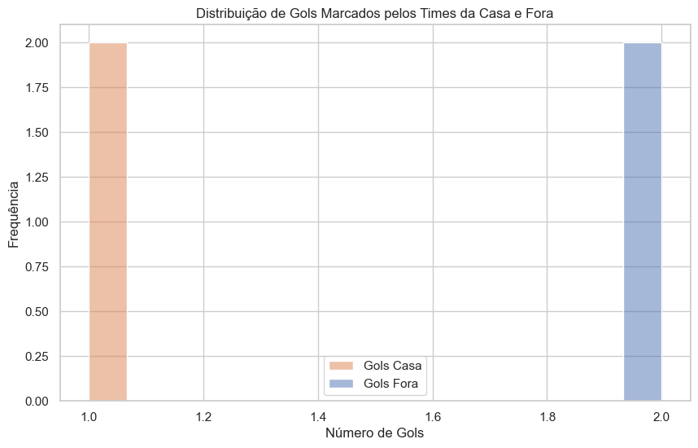 
  
  <sup>Fonte: Elaborado pelos autores(2024)</sup> 
  
</div>

Insight Principal: O gráfico sugere uma distribuição equilibrada dos gols marcados por times da casa e fora, indicando que, neste conjunto de dados específico, o fator casa não parece influenciar significativamente o número de gols marcados.

#### Gráfico 2: Relação entre PPG Pré-Jogo e Gols Marcados

O segundo gráfico explora a relação entre o "Points Per Game" (PPG) antes do jogo e o número de gols marcados pelos times da casa e visitantes. Utilizando um gráfico de dispersão, foi possível visualizar como a performance pré-jogo (PPG) se relaciona com a eficácia ofensiva das equipes. Este gráfico é fundamental para entender se o desempenho histórico das equipes pode ser um bom preditor para os resultados futuros.

<div align="center"> 
  
  <sup>Gráfico 2 - Relação entre PPG Pré-Jogo e Gols Marcados<sup> 
  
  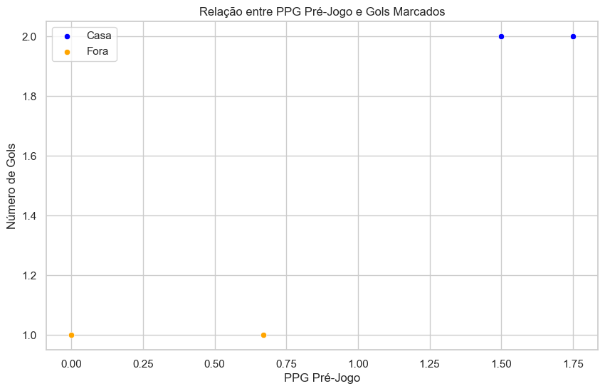 
  
  <sup>Fonte: Elaborado pelos autores(2024)<sup> 
  
</div>

Insight Principal: Existe uma correlação perceptível entre o PPG Pré-Jogo e os gols marcados, sugerindo que equipes com melhor desempenho histórico tendem a manter essa performance durante as partidas.

#### Gráfico 3: Relação entre Posse de Bola e Gols Marcados

Por fim, o terceiro gráfico investiga a relação entre a posse de bola e o número de gols marcados pelos times da casa e visitantes. Este gráfico de dispersão permite analisar se o controle do jogo (refletido pela posse de bola) se traduz diretamente em resultados concretos, como marcar gols.

<div align="center"> 
  
  <sup>Gráfico 3 - Relação entre Posse de Bola e Gols Marcados<sup> 
  
  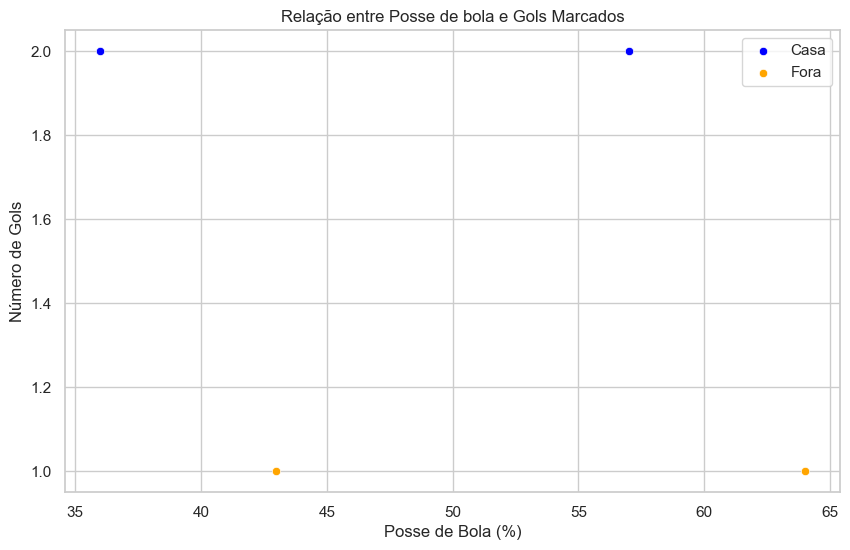 
  
  <sup>Fonte: Elaborado pelos autores(2024)<sup> 
  
</div>

Insight Principal: Embora a posse de bola seja importante, este gráfico pode revelar que times com menor posse de bola também conseguem marcar gols, indicando que a eficácia nas finalizações pode ser um fator mais crítico que a posse. 

Esses três gráficos oferecem uma visão abrangente e detalhada dos fatores que podem influenciar o desempenho dos times em uma partida de futebol, proporcionando uma base sólida para o desenvolvimento de modelos preditivos mais precisos.

#### 4.2.2. Pré-processamento dos dados

&nbsp;&nbsp;&nbsp;&nbsp;O pré-processamento é uma etapa consiste em melhorar a qualidade dos dados, visto que, muitas vezes, uma base de dados grande não é útil para algoritmos de aprendizado de máquina, devido a presença de atributos irrelevantes e valores ausentes ou redundantes, por exemplo. Assim, há diversas técnicas para realizar esse processo, as quais envolvem a limpeza de dados com remoção de valores ausentes ou inconsistentes, normalização de escalas e redução de dimensionalidades, utilizada principalmente para lidar com informações redundantes, e detecção de _outliers_. 

&nbsp;&nbsp;&nbsp;&nbsp;Cabe lembrar que todos os valores ausentes nas bases de dados do projeto já estavam padronizados com o valor 0 no tipo numérico, portanto, não houve a necessidade de tratá-los com nenhuma técnica.

&nbsp;&nbsp;&nbsp;&nbsp;Por fim, como há três tabelas diferentes para a criação do modelo preditivo, a limpeza foi feita separadamente em cada tabela:

**Tabela partidas**

&nbsp;&nbsp;&nbsp;&nbsp;Para a tabela referente às partidas (`brazil-serie-a-matches-2024-to-2024-stats`), houve de antemão uma filtragem, pois ela continha dados de todos os jogos, incluindo os que ainda não ocorreram, portanto, houve uma necessidade de remover todas as linhas dos jogos incompletos. Tal procedimento foi realizado usando o seguinte trecho de código:

```python
matches = pd.read_csv('./Data/brazil-serie-a-matches-2024-to-2024-stats_edit.csv', sep=';')
matches = matches.query('status == "complete"') #Filtra apenas as partidas que já ocorreram
```

&nbsp;&nbsp;&nbsp;&nbsp;Após isso, precisou-se realizar uma limpeza, removendo as colunas que não representam nenhum dado. Para isso, foi realizado um _loop_ que iterasse por todas as colunas numéricas calculando o desvio padrão e removendo aquelas que possuíssem esse valor igual a zero (ou seja, removendo as colunas com todos os dados iguais ou vazias). Para isso, usou-se o trecho exposto a seguir:

```python
for col in matches.columns:
    if np.issubdtype(matches[col].dtype, np.number):
        std_dev = matches[col].std()
    
    if std_dev == 0:
        matches = matches.drop(columns=[col])
```

&nbsp;&nbsp;&nbsp;&nbsp;Agora que os dados foram limpos, deixando apenas os necessários, verifica-se que todos as informações importantes para o treinamento do modelo são numéricas, portanto não há necessidade de [transformação de dados categóricos](https://youtu.be/ZPTAeXfaZ4g?si=etm4_StslmbJGm0n). Os dados categóricos referem-se aos nomes dos times, datas, completude das partidas, nomes dos árbitros, entre outros dados relevantes apenas à visualização. Esses dados são bem pontuais, não havendo necessidade de realizar processos de [normalização](https://www.alura.com.br/artigos/normalizacao?srsltid=AfmBOor_DvsmSe6NfsfJ_1pzrTNXSFu9tYrrADVq0R5LtdEm2ii_wqNB).

&nbsp;&nbsp;&nbsp;&nbsp;Seguindo com o pré-processamento, foi utilizado a técnica [z-score](https://docs.oracle.com/cloud/help/pt_BR/pbcs_common/PFUSU/insights_metrics_Z-Score.htm#PFUSU-GUID-640CEBD1-33A2-4B3C-BD81-EB283F82D879) para a identificação e remoção de [outliers](https://blog.dp6.com.br/t%C3%A9cnicas-de-detec%C3%A7%C3%A3o-de-anomalias-3d9e216bf82e). Com um _loop_, foi possível aplicar o algoritmo para todas as colunas numéricas, removendo os _outliers_ identificados e substituindo-os pela média, visto que essa foi a técnica mais eficiente após alguns testes em modelos que foram feitos. Esses procedimentos estão expostos no trecho a seguir:

```python
for col in matches.columns:
    if np.issubdtype(matches[col].dtype, np.number):
        mean = matches[col].mean()
        std_dev = matches[col].std()

        matches['z_score'] = (matches[col] - mean) / std_dev
        threshold = 1.8
        matches['is_outlier'] = np.abs(matches['z_score']) > threshold

        matches.loc[matches['is_outlier'], col] = mean

matches = matches.drop(columns=['z_score', 'is_outlier'])
```

**Tabela times**

&nbsp;&nbsp;&nbsp;&nbsp;Na tabela referente aos times (`brazil-serie-a-teams2-2024-to-2024-stats`), estão presentes dados estatísticos dos times, sobre os quais foram realizados os mesmos procedimentos da tabela anterior: a limpeza de colunas que não representam nenhum dado, a remoção dos _outliers_ utilizando z-score e também a substituição dos valores aberrantes pela média:  

```python
# Abertura do arquivo
teams = pd.read_csv('./Data/brazil-serie-a-teams2-2024-to-2024-stats.csv')

# Remoção de colunas sem dados relevantes
for col in teams.columns:
    if np.issubdtype(teams[col].dtype, np.number):
        std_dev = teams[col].std()
    
    if std_dev == 0:
        teams = teams.drop(columns=[col])
```

&nbsp;&nbsp;&nbsp;&nbsp;No caso da remoção dos _outliers_ desta tabela (times), foi utilizado um limiar maior. Tal escolha foi realizada após uma análise de cada coluna, o que mostrou o significado de alguns desses valores anormais, expondo que eles não poderiam ser removidos e que seriam importantes para análises futuras, como quantidade de cartões recebidos ou quantidade de gols. A seguir, ações para a limpeza de _outliers_:

```python
# Remoção dos outliers
for col in teams.columns:
    if np.issubdtype(teams[col].dtype, np.number):
        mean = teams[col].mean()
        std_dev = teams[col].std()

        teams['z_score'] = (teams[col] - mean) / std_dev
        threshold = 2.5
        teams['is_outlier'] = np.abs(teams['z_score']) > threshold

        teams.loc[teams['is_outlier'], col] = mean

teams = teams.drop(columns=['z_score', 'is_outlier'])
```

**Tabela jogadores**

&nbsp;&nbsp;&nbsp;&nbsp;Realizou-se também o pré-processamento na a tabela dos jogadores (`brazil-serie-a-players-2024-to-2024-stats`). Nesta tabela, foi verificado que não havia necessidade de remoção de _outliers_, pois os todos os dados, após a realização de testes, se mostraram relevantes para as análises e condizentes com o contexto explorado. Por exemplo, na quantidade de gols, é plausível que alguns jogadores façam 5 ou 6 gols em um campeonato enquanto alguns não façam gol algum (como o goleiro). Desse modo, foi realizado apenas o procedimento de remoção de colunas irrelevantes, como se segue:

```python
# abertura do arquivo
players = pd.read_csv('./Data/brazil-serie-a-players-2024-to-2024-stats.csv')

for col in players.columns:
    # Verifica se a coluna é numérica
    if np.issubdtype(players[col].dtype, np.number):
        mean = players[col].mean()
        std_dev = players[col].std()

        if std_dev == 0:
            players = players.drop(columns=[col])
```

**Salvamento dos resultados**

&nbsp;&nbsp;&nbsp;&nbsp;Por fim, após realizar o pré-processamento em cada uma das tabelas, foram criadas outras tabelas para salvar o que foi realizado usando o trecho de código a seguir:

```python
matches.to_csv('./Data/partidas.csv')
teams.to_csv('./Data/times.csv')
players.to_csv('./Data/jogadores.csv')
```

#### 4.2.3. Hipóteses

**Hipótese 1** 

&nbsp;&nbsp;&nbsp;&nbsp;A primeira hipótese gerada está relacionada às probabilidades de vitória do time visitante. Ela é regida pela seguinte regra: o time visitante tem maiores chances de vitória quando é o primeiro a pontuar na partida. Essa hipótese surgiu após nos questionarmos sobre alguns estudos acerca da vantagem do time da casa sobre o adversário. Isso levantou o questionamento sobre encontrar algo em comum que pudesse auxiliar o time visitante a alcançar a vitória sobre o time da casa. Durante uma de nossas buscas, identificamos um padrão: quando o time visitante pontuava primeiro, ele, na maioria das vezes, conseguia a vitória.

&nbsp;&nbsp;&nbsp;&nbsp;Após realizarmos uma amostragem nos dados e arquivos disponibilizados pelo parceiro, encontramos a seguinte relação (Figura 9):

  > Os times que mais pontuam fora de casa (eixo X) também apresentam uma quantidade de vitórias superior 
  > quando comparados aos times que não marcaram gols no primeiro tempo.
 

<div align="center">
  
  <sup>Figura 9 - Gráfico de relação entre "Porcentagem de jogos onde o visitante é o primeiro a pontuar" por "Vitórias do Visitante" </sup>
      
  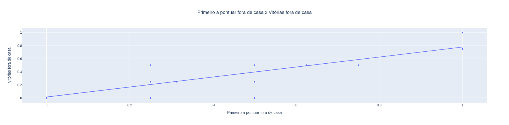
      
  <sup>Fonte: Material produzido pelos autores (2024)</sup>
  
</div>

  > - O gráfico demonstra a relação entre o time ser o primeiro a pontuar fora de casa e a sua taxa de vitórias.
  > - O eixo X descreve a porcentagem de jogos onde ele foi o primeiro a pontuar. O valor foi normalizado para uma escala que vai de 0 a 1.
  > - O eixo Y descreve o número de jogos ganhos pelo time fora de casa. O valor foi normalizado para uma escala que vai de 0 a 1.
  
&nbsp;&nbsp;&nbsp;&nbsp;Apesar de encontrarmos uma correlação entre as vitórias e o time que marca o primeiro gol, seria necessário identificar novos fatores relacionados à hipótese gerada. Os valores utilizados no levantamento da hipótese são estáticos e podem variar com o tempo. Talvez essa tendência se mantenha para este campeonato ou em rodadas específicas; porém, uma mudança na amostra pode alterá-la.

&nbsp;&nbsp;&nbsp;&nbsp; O notebook no qual os gráficos desta hipótese foram gerados estão também disponíveis no [Anexo C](#anexos).
 
**Hipótese 2**

&nbsp;&nbsp;&nbsp;&nbsp;A segunda hipótese busca estabelecer uma relação entre a quantidade de partidas jogadas por um time e variáveis como gols, chutes ao gol, faltas, cartões, etc. No futebol, é comum que haja uma diferença significativa entre as datas das partidas, o que faz com que, em certos momentos do campeonato, alguns times tenham jogado mais partidas que outros. Tal diferença na quantidade de partidas disputadas pode causar imprecisões nas predições, visto que essa diferença acaba por "inflar" certas informações em detrimento de outras. Para ilustrar essa ideia, imaginemos que, ao fazer a predição com o nosso modelo, comparamos o time A, que disputou 8 partidas até o momento, com o time B, que disputou 10 partidas. Nas duas partidas que o time B jogou a mais, ele pode ter realizado mais chutes a gol, recebido mais cartões e feito mais gols que o time A. Nesse sentido, os dados podem levar a conclusões erradas apenas por não estarem considerando o mesmo espaço amostral para realização das análises.

&nbsp;&nbsp;&nbsp;&nbsp;Ainda nesse contexto, tem-se o gráfico a seguir que apresenta o número de ações realizadas pelos clubes de futebol São Paulo e Criciúma que, como no exemplo anterior, disputaram 10 e 8 partidas respectivamente:

<div align="center">
  
  <sup>Figura 10 - Gráfico apresentando relação entre as colunas do São Paulo e Criciúma</sup>  
    
  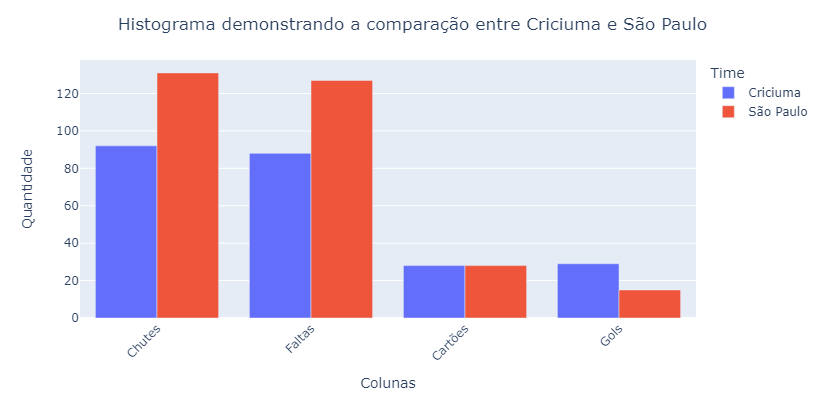
  
  <sup>Fonte: Material produzido pelos autores (2024)</sup>
  
</div>

&nbsp;&nbsp;&nbsp;&nbsp;Ao analisar o gráfico, observamos que o São Paulo, com duas partidas a mais que o Criciúma, também apresenta uma maior quantidade de chutes ao gol e faltas. A princípio, o algoritmo pode interpretar isso como uma maior probabilidade de o São Paulo marcar um gol, visto que ele chuta mais vezes ao gol, ou como uma maior chance de perder a partida, visto que comete mais faltas. No entanto, esses resultados podem representar um falso positivo, uma vez que o Criciúma jogou duas partidas a menos que o São Paulo e, nessas partidas restantes, a quantidade de chutes ao gol e faltas pode se equilibrar, o que alteraria os resultados gerados pelo modelo preditivo. Além disso, é possível perceber que, mesmo com duas partidas a mais, o São Paulo possui menos gols e a mesma quantidade de cartões que o Criciúma, o que pode levar a imprecisões no modelo, considerando que o Criciúma ainda tem duas partidas nas quais poderia aumentar essa diferença.

&nbsp;&nbsp;&nbsp;&nbsp; O notebook no qual os gráficos desta hipótese foram gerados estão também disponíveis no [Anexo D](#anexos).
 
**Hipótese 3**
 
&nbsp;&nbsp;&nbsp;&nbsp;A partir de análises preliminares das tabelas relativas às partidas da Série A do Campeonato Brasileiro, propõe-se a hipótese de que a chance de um time da casa receber um cartão amarelo no decorrer da partida é menor que a chance de um time visitante receber a mesma punição.

&nbsp;&nbsp;&nbsp;&nbsp;Nesse contexto, realizou-se uma pequena comparação entre o total de cartões amarelos recebidos por times que jogavam em casa com aqueles que jogavam como visitantes (Figura 11).

<div align="center">
  
  <sup> Figura 11 - Quantidade de cartões amarelos por time</sup>
  
  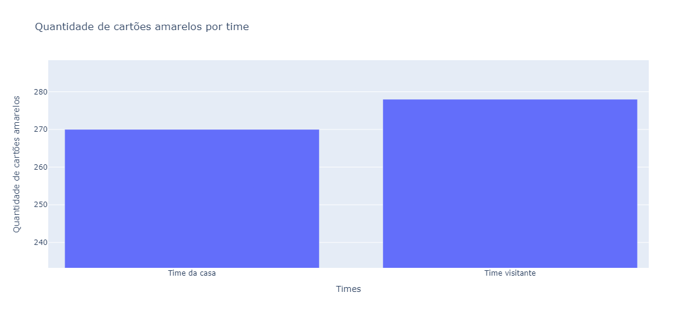
  
  <sup>Fonte: Material produzido pelos autores (2024)</sup>
  
</div>

&nbsp;&nbsp;&nbsp;&nbsp;A partir da imagem, nota-se que, de fato, há uma diferença no número de cartões amarelos, nos quais os times da casa receberam um total de cartões amarelos maior que os visitantes. 

&nbsp;&nbsp;&nbsp;&nbsp;Um detalhe curioso é que esse padrão não se repete quando analisados os cartões vermelhos recebidos pelos times (Figura 12).

<div align="center">
  
  <sup> Figura 12 - Quantidade de cartões vermelhos por time</sup>
  
  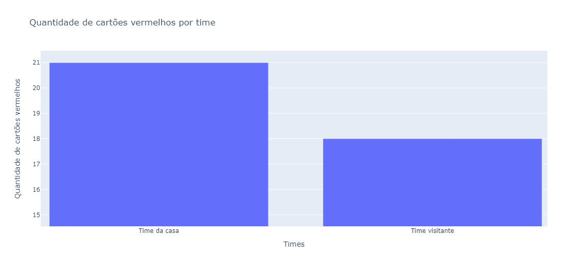
  
  <sup>Fonte: Material produzido pelos autores (2024)</sup>
  
</div>

&nbsp;&nbsp;&nbsp;&nbsp;Nela, percebe-se que, apesar de receberem menos cartões amarelos, os times da casa recebem mais cartões vermelhos que os visitantes. 

&nbsp;&nbsp;&nbsp;&nbsp;Para melhor compreensão de como essas informações se relacionam e as origens de tais padrões, é necessária a realização de mais testagens e experimentações, a fim de se chegar a alguma conclusão.

&nbsp;&nbsp;&nbsp;&nbsp; O notebook no qual os gráficos desta hipótese foram gerados estão também disponíveis no [Anexo E](#anexos).

### 4.3. Preparação dos Dados e Modelagem

#### 4.3.1. Modelagem do notebook escalacao.ipynb (Resultados por escalação):

[Notebook](../notebooks/External/escalacao.ipynb)

##### a) Organização dos dados: 
Os dados foram organizados em três subconjuntos: treinamento, validação e testes. A divisão foi feita da seguinte forma:

Treinamento: 75% dos dados foram usados para treinar os modelos.
Validação: 20% foram destinados à validação, para ajustar os hiperparâmetros e evitar o _overfitting_.
Teste: Os 5% restantes foram usados para avaliar a performance final do modelo em dados não vistos.

Os dados incluem informações de partidas de futebol, como o número de gols, cruzamentos, interceptações e dribles de jogadores. Cada instância contém o time, a formação tática e a performance de jogadores em diferentes partidas.

#### _Features_:
##### Jogadores:
- _goals_overall_
- _crosses_per_game_overall_
- _dribbles_per_game_overall_
- _interceptions_per_game_overall_
- _assists_per_game_overall_
- _penalty_goals_

##### Times:
- _shots_on_target_
- _shots_
- _average_possession_
- _average_total_goals_per_match _
- _win_percentage_
- _fts_percentage_
- _common_name_
- _points_per_game_
- _fouls_
- _wins_
- _draws_
- _losses_

##### Confrontos:
- _home_team_name_
- _away_team_name_
- _home_team_goal_count_
- _away_team_goal_count_
- _home_pre_match_xg_
- _away_pre_match_xg_
- _home_ppg_
- _away_ppg_
- _average_goals_per_match_pre_match_
- _average_corners_per_match_pre_match_
- _btts_percentage_pre_match_

##### b) Modelagem para o problema (proposta de _features_): 
Para prever o placar final ou a probabilidade de vitória de um time, foram selecionadas _features_ que refletem a performance individual e coletiva dos jogadores e times. _Features_ como o número de gols totais, cruzamentos, dribles e interceptações foram escolhidas com base em sua relevância histórica para o desempenho em campo. Além disso, variáveis sobre a formação tática e _clusters_ de jogadores foram adicionadas, usando o algoritmo K-Means para identificar padrões de desempenho em diferentes formações.

##### c) Métricas relacionadas ao modelo: As principais métricas utilizadas para avaliar a performance dos modelos foram:

- Acurácia: Para medir a porcentagem de previsões corretas, principalmente na classificação de vitória, derrota ou empate.

- Matriz de Confusão: Para visualizar o desempenho do modelo em cada classe (vitória, empate, derrota), destacando erros e acertos.

- F1-Score: Para equilibrar precisão e sensibilidade, considerando a distribuição das classes.

##### d) Apresentar o primeiro modelo candidato:
O primeiro modelo candidato foi o _Random Forest_[[18]](#6-referências), uma técnica de aprendizado supervisionado. Ele foi escolhido por sua robustez em lidar com dados complexos e não-lineares, comuns em previsões de resultados de partidas. O modelo foi configurado com 100 estimadores (árvores), e sua profundidade máxima foi ajustada após validações cruzadas. O modelo apresentou uma acurácia de 55%, o que foi promissor, embora tenha revelado desafios em prever resultados de jogos equilibrados.

A matriz de confusão mostrou que o modelo teve dificuldades em prever empates, sugerindo que ajustes adicionais nas features ou na modelagem seriam necessários para melhorar esse aspecto.

#### 4.3.2 Modelagem do notebook QualJogadorFazerGol.ipynb (quais jogadores tem mais chance de fazer o primeiro gol):

&nbsp;&nbsp;&nbsp;&nbsp;O modelo explicitado a seguir busca prever os resultados para a seguinte pergunta: “qual jogador tem a maior probabilidade de marcar gols na partida?”. Para isso, foi realizada uma análise dos dados e alguns testes com diferentes modelos preditivos, assim, chegando a um modelo vencedor, ou seja, que tem melhores resultados. Todo o progresso de testes e a modelagem estão no Notebook Jupyter: [Notebook](../notebooks/QuaisJogadoresFaraoOGol/QualJogadorFazerGol.ipynb)

&nbsp;&nbsp;&nbsp;&nbsp;A separação dos dados e escolha das features são etapas essenciais para o desenvolvimento de um modelo preditivo que funcione corretamente. Muitas vezes quando um modelo não está funcionando da maneira que deveria, o problema não está no algoritmo, mas sim na seleção, filtragem e pré processamento dos dados [[16]](#6-referências). 
Após os dados estarem limpos, há uma necessidade de separá-los em duas ou três partes da seguinte maneira [[17]](#6-referências):

-  _Train set_: refere-se a maior parte dos dados (de 80% a 60%), que será utilizada para o treinamento do modelo preditivo em si através de uma base extensa de exemplos;

- _Test set_: contém de 10% a 40% dos dados. refere-se aos que serão utilizados no teste do modelo para obter uma estimativa realista da performance do modelo, gerando métricas como acurácia que serão abordadas posteriormente;

- _Validation set_ (opcional): tem como objetivo auxiliar no ajuste de hiperparâmetros como taxas de aprendizado, por exemplo, e verificar a performance do modelo durante o treinamento, assim ajudando a evitar o overfitting.


&nbsp;&nbsp;&nbsp;&nbsp;Primeiramente foi realizada esta separação dos dados em _train set_ e _test set_ da tabela jogadores, pois como a densidade de dados não é tão alta, foi preferível manter uma quantidade grande para o treinamento do modelo. Tendo isso em mente, os dados foram separados proporcionalmente a 80% para treino e 10% para teste e 10% para validação, de uma maneira aleatória para evitar com que o modelo fosse enviesado por alguma ordem de distribuição de dados específica.

&nbsp;&nbsp;&nbsp;&nbsp;Dado isso, a equipe decidiu utilizar o _Random Forest_ de classificação, pois esse algoritmo lida bem com uma grande variedade de dados. Ele combina diferentes árvores de decisão, gerando um modelo mais preciso ao utilizar amostras aleatórias dos dados de treinamento. Cada árvore construída vota na classe mais provável, e a classe com o maior número de votos é escolhida como a predição final[[18]](#6-referências). Essa abordagem foi considerada a mais adequada para responder à principal pergunta proposta, na qual as respostas seriam binárias: o jogador fez ou não fez o primeiro gol.

&nbsp;&nbsp;&nbsp;&nbsp;A acurácia inicial desse modelo foi de 100%, indicando um possível _overfitting_, o que significa que o modelo pode estar ajustado demais aos dados de treino. Após plotar um gráfico de matriz de confusão, que é uma tabela usada para verificar o desempenho do modelo em termos de acertos e erros, com o eixo Y representando os valores reais e o eixo X representando os valores previstos, foi possível identificar erros específicos em cada classe. Essa visualização ajuda a entender melhor o desempenho do modelo e a tomar decisões para ajustes. Abaixo, na figura 13, está a matriz de confusão identificada.
 
<div align="center">
  
  <sup> Figura 13 - Matriz de correlação</sup>
  
  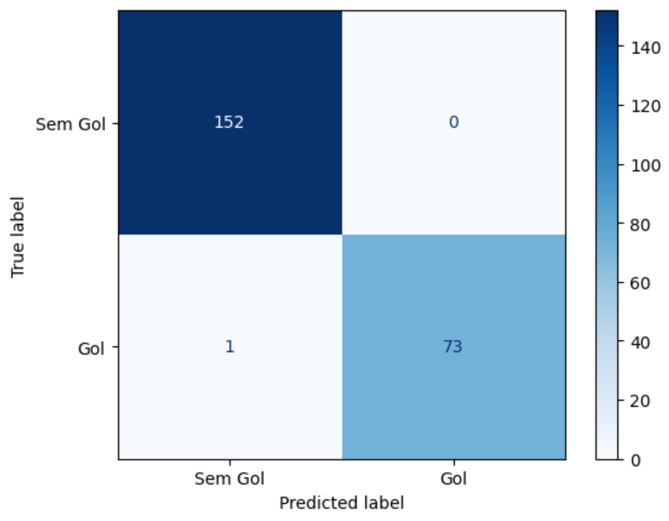
  
  <sup>Fonte: Material produzido pelos autores (2024)</sup>
  
</div>

&nbsp;&nbsp;&nbsp;&nbsp;A matriz de confusão mostra que praticamente não ocorreram erros, reforçando a possibilidade de _overfitting_ mencionada anteriormente. Além da matriz de confusão, foi feita uma predição, conforme visto na figura Y. No entanto, a previsão não atingiu o nível de precisão esperado. Basicamente, o modelo indicou que a maioria dos jogadores teria a possibilidade de fazer um gol, resultando em uma predição constante do número 1. Essa resposta não atende ao objetivo de identificar qual jogador será o primeiro a marcar, já que todos têm a chance de ser o primeiro.

<div align="center">
  
  <sup> Figura 14 - Previsão do primeiro jogador a fazer gol</sup>
  
  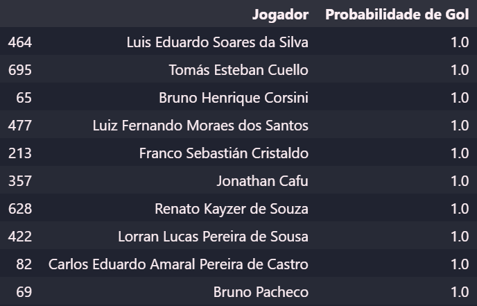
  
  <sup>Fonte: Material produzido pelos autores (2024)</sup>
  
</div>

&nbsp;&nbsp;&nbsp;&nbsp;Diante dessa dificuldade, a equipe decidiu que seria mais adequado mudar para o modelo _Random Forest de regressão_, pois ele é mais eficiente em lidar com probabilidades e resultados contínuos. Ao contrário do modelo de classificação, que é mais adequado para problemas binários (sim ou não), o modelo de regressão oferece uma abordagem mais apropriada para prever valores contínuos e a probabilidade de eventos.

&nbsp;&nbsp;&nbsp;&nbsp;Mesmo com a adoção do novo modelo, os resultados ainda não foram satisfatórios. Assim, foi realizada uma limpeza mais intensa nos dados. No entanto, não houve uma grande diferença até a adoção do PCA (Análise de Componentes Principais). O PCA é uma técnica de redução de dimensionalidade que seleciona as principais características (_features_) do conjunto de dados. Ele transforma as variáveis originais em um novo conjunto de variáveis, chamadas componentes principais, que são combinações lineares das variáveis iniciais. Essas componentes capturam a maior parte da variabilidade dos dados, permitindo uma análise mais eficiente e a melhoria dos resultados do modelo. Após a adoção do PCA, houve uma melhora significativa nas métricas do modelo.

&nbsp;&nbsp;&nbsp;&nbsp;As métricas são muito importantes para medir o desempenho do modelo preditivo, mostrando o quão eficaz ele realmente é. Para o primeiro modelo que foi utilizado _Random Forest Classifier_, ou _random forest_ de classificação, foi calculado a precisão (ou acurácia) [[19]](#6-referências), que variou entre 99% e 100%. Neste caso, é possível calcular o _recall_ e o _f1-score_ também, porém como foi identificado que o modelo não se encaixaria para o que estava sendo procurado, foi logo substituído por um modelo de regressão.

&nbsp;&nbsp;&nbsp;&nbsp;No caso do _Random Forest Regressor_, ou _random forest_ de regressão, foi calculado o MSE (_Mean Squared Error_ ou Erro Quadrático Médio) que é uma representação da porcentagem de erro em relação aos números reais, porém elevado ao quadrado, ou seja, caso erre o número por x unidades, o MSE terá seu valor aumentado em x² unidades. Dessa maneira é possível ter uma ideia se o modelo está errando muito ou não, pois o aumento do valor da métrica implica num aumento de erro do modelo. Além do MSE, também foi calculado o R² (coeficiente de determinação) que representa o percentual da variância dos dados, mostrando se o modelo é explicativo ou não. Sabendo que o R² é um número entre 0 e 1, sendo que ao se aproximar de 1 implica em um modelo mais explicativo, pode-se ter uma ideia melhor se o modelo está realmente explicando aquilo que é necessário [[20]](#6-referências). Assim, as métricas encontradas para o modelo de regressão foram:
- MSE = 3
-  R² = 0,59

&nbsp;&nbsp;&nbsp;&nbsp;Por fim, tendo em vista as métricas analisadas acima, o modelo com o melhor desempenho foi com a implementação do algoritmo de regressão (_Random Forest Regressor_). Além dos testes realizados através dos cálculos, também foram realizados alguns testes manuais e, com isso, também foi possível embasar a escolha do modelo em questão.

#### 4.3.3 Modelagem do notebook RandomForest_Predicao_Vencedor_Futebol.ipynb - Vencedor de Partidas(%):

[Notebook](../notebooks/RandomForest_Predicao_Vencedor_Futebol.ipynb)

#### a) **Organização dos Dados**

No processo de organização dos dados, foi utilizado o método clássico de divisão entre conjuntos de treino e teste, com uma proporção de 70% para treinamento e 30% para testes. Isso garante que o modelo tenha dados suficientes para aprender, enquanto uma porção significativa é reservada para avaliar o desempenho do modelo em novos dados.

O código utilizado para essa divisão foi o seguinte:

```python
from sklearn.model_selection import train_test_split

X_train, X_test, y_train, y_test = train_test_split(X, y, test_size=0.3, random_state=42)
```
 - **`X`**: Essa variável representa a *array* com as características que serão usadas para treinar o modelo.
 - **`y`**: Variável que armazena o valor alvo (*target*) que o modelo deve prever.
 - **`test_size=0.3`**: Aqui esta sendo definida a proporção dos dados que serão usadas no conjunto de teste, 30% dos dados serão usados para testar o modelo, e os 70% restantes serão usados para treinamento.
 - **`random_state=42`**: Garante que a divisão dos dados seja reprodutível. Isso significa que a mesma divisão será realizada toda vez que o código for executado, o que é útil para comparações consistentes e reprodutíveis.

- **`X_train`**: Contém 70% das amostras de `X`. Esse conjunto de dados será usado para treinar o modelo.
- **`X_test`**: Contém 30% das amostras de `X`. Esse conjunto de dados será usado para testar o modelo.
- **`y_train`**: Contém 70% dos rótulos de `y`, correspondendo aos dados em `X_train`. Usado para treinar o modelo.
- **`y_test`**: Contém 30% dos rótulos de `y`, correspondendo aos dados em `X_test`. Usado para avaliar o desempenho do modelo.

Essa proporção é uma escolha comum que oferece um bom equilíbrio. Permite que o modelo tenha dados suficientes para aprender e ajustar seus parâmetros, enquanto reserva uma quantidade substancial de dados para avaliar como o modelo se comporta em dados não vistos.

A função `train_test_split` da biblioteca `sklearn` é uma ferramenta que separa os dados de maneira aleatório mantendo a distribuição das classes entre os conjuntos de treino e teste. Ao realizar essa divisão o modelo é avaliado de forma consistente, ajudando a evitar *overfitting*.

Os dados uitilizados incluem colunas da tabela de `matches` com informações de histórico de partidas anteriores e da tabela `teams` que contêm estatísticas importando dos times do campeonato.

#### b) **Modelagem para o Problema**

A modelagem do problema foi feita utilizando como *features* as colunas diretamente relacionadas ao desempenho das equipes e ao contexto dos jogos. As *features* incluídas foram:


1. **Número de partidas jogadas**:
   - `matches_played_a`: Número de partidas jogadas pelo time visitante
   - `matches_played_h`: Número de partidas jogadas pelo time da casa

2. **Vitórias**:
   - `wins_h`: Número de vitórias do time da casa
   - `wins_a`: Número de vitórias do time visitante

3. **Empates**:
   - `draws_h`: Número de empates do time da casa
   - `draws_a`: Número de empates do time visitante

4. **Derrotas**:
   - `losses_h`: Número de derrotas do time da casa
   - `losses_a`: Número de derrotas do time visitante

5. **Pontos por jogo**:
   - `points_per_game_h`: Pontos por jogo do time da casa
   - `points_per_game_a`: Pontos por jogo do time visitante

6. **Posição na liga**:
   - `league_position_h`: Posição na liga do time da casa
   - `league_position_a`: Posição na liga do time visitante

7. **Gols marcados**:
   - `goals_scored_h`: Gols marcados pelo time da casa
   - `goals_scored_a`: Gols marcados pelo time visitante

8. **Gols sofridos**:
   - `goals_conceded_h`: Gols sofridos pelo time da casa
   - `goals_conceded_a`: Gols sofridos pelo time visitante

9. **Minutos por gol marcado**:
   - `minutes_per_goal_scored_h`: Minutos por gol marcado pelo time da casa
   - `minutes_per_goal_scored_a`: Minutos por gol marcado pelo time visitante

10. **Contagem de BTTS (Both Teams to Score)**:
    - `btts_count_h`: Contagem de BTTS para o time da casa
    - `btts_count_a`: Contagem de BTTS para o time visitante

11. **Chutes totais**:
    - `shots_h`: Chutes totais do time da casa
    - `shots_a`: Chutes totais do time visitante

12. **Chutes no alvo**:
    - `shots_on_target_h`: Chutes no alvo do time da casa
    - `shots_on_target_a`: Chutes no alvo do time visitante

13. **Chutes fora do alvo**:
    - `shots_off_target_h`: Chutes fora do alvo do time da casa
    - `shots_off_target_a`: Chutes fora do alvo do time visitante

14. **Percentual de primeiro time a marcar**:
    - `first_team_to_score_percentage_h`: Percentual de vezes que o time da casa foi o primeiro a marcar
    - `first_team_to_score_percentage_a`: Percentual de vezes que o time visitante foi o primeiro a marcar

15. **Faltas**:
    - `fouls_h`: Faltas cometidas pelo time da casa
    - `fouls_a`: Faltas cometidas pelo time visitante

16. **Cartões por partida**:
    - `cards_per_match_h`: Cartões por partida do time da casa
    - `cards_per_match_a`: Cartões por partida do time visitante

O código utilizado para essa seleção foi o seguinte:

```python
selected_tables = [
    'matches_played_a', 'matches_played_h',
    'wins_h', 'wins_a',
    'draws_h', 'draws_a',
    'losses_h', 'losses_a',
    'points_per_game_h', 'points_per_game_a',
    'league_position_h', 'league_position_a',
    'goals_scored_h', 'goals_scored_a',
    'goals_conceded_h', 'goals_conceded_a',
    'minutes_per_goal_scored_h', 'minutes_per_goal_scored_a',
    'btts_count_h', 'btts_count_a',
    'shots_h', 'shots_a',
    'shots_on_target_h', 'shots_on_target_a',
    'shots_off_target_h', 'shots_off_target_a',
    'first_team_to_score_percentage_h', 'first_team_to_score_percentage_a',
    'fouls_h', 'fouls_a',
    'cards_per_match_h', 'cards_per_match_a'
]

x = data[selected_tables]
y = data['winner']
```

Essas *features* foram selecionadas com base na relevância delas no contexto do futebol, e sua inclusão visa capturar as dinâmicas da partida, como vantagem do time da casa e agressividade das equipes (medida por chutes a gol).

A variável alvo, **`winner`**, foi selecionada como a variável preditiva, representando o vencedor da partida.

#### c) **Métricas Relacionadas ao Modelo**

Para avaliar o desempenho do modelo, foram utilizadas três métricas principais [[18]](#6-referências):

1. **Acurácia**: Mede a proporção de previsões corretas entre todas as previsões realizadas.

2. **Precisão**: Avalia quantas das previsões de uma classe foram corretas, ou seja, das previsões feitas como "vencedor", quantas estavam corretas.
  

3. ***Recall***: Mede a capacidade do modelo de identificar corretamente todos os exemplos de uma determinada classe.

4. ***F1-Score***: A média harmônica entre a precisão e o *recall*, que balanceia as duas métricas.

5. **Curva ROC e AUC (Área Sob a Curva)**: Foi utilizada para avaliar a capacidade do modelo em classificar corretamente os resultados. A curva ROC plota a taxa de verdadeiros positivos (TPR) contra a taxa de falsos positivos (FPR). A AUC (Área Sob a Curva) foi calculada para quantificar a capacidade do modelo de distinguir diferentes classes. Quanto mais próxima de 1 for a AUC, melhor o modelo é em distinguir entre as classes.

Essas métricas foram calculadas para fornecer uma visão mais detalhada do desempenho do modelo em diferentes aspectos.

#### d) **Primeiro Modelo Candidato e Discussão dos Resultados**

O primeiro modelo candidato utilizado foi o ***Random Forest Classifier***. Esse modelo foi escolhido pois, como estamos lidando com um problema de classificação binária, temos que prever um vencedor entre duas equipes. O Random Forest é especialmente útil para esse tipo de tarefa, pois consegue lidar bem com conjuntos de dados com muitas variáveis, como estatísticas de partidas anteriores e características dos times [[21]](#6-referências).

O modelo foi treinado utilizando o conjunto de treinamento depois de ser balanceado:

```python
from sklearn.ensemble import RandomForestClassifier

rf_model_balanced = RandomForestClassifier(n_estimators=100, random_state=42)
rf_model_balanced.fit(X_train_balanced, y_train_balanced)
```

Após o treinamento, o modelo foi testado com os dados de teste, e as métricas de desempenho foram avaliadas. A acurácia do modelo foi obtida, assim como as demais métricas mencionadas:

```python
y_pred_balanced = rf_model_balanced.predict(X_test_balanced)

print(f"Acurácia: {accuracy_score(y_test_balanced, y_pred_balanced) * 100:.2f}%")
print(classification_report(y_test_balanced, y_pred_balanced))
```
Além disso, a matriz de confusão foi analisada com a finalidade de nos dá uma visão clara de onde o modelo errou ou acertou nas previsões. Na matriz, observamos as classificações corretas e incorretas para cada time [[21]](#6-referências).

```python
conf_matrix = confusion_matrix(y_test_balanced, y_pred_balanced, labels=[1, 2, 0])
plt.figure(figsize=(10, 7))
sns.heatmap(conf_matrix, annot=True, fmt='d', cmap='Blues', xticklabels=['Vitória do time da casa', 'Vitória do time de fora', 'Empate'], yticklabels=['Vitória do time da casa', 'Vitória do time de fora', 'Empate'])
plt.xlabel('Previsão')
plt.ylabel('Real')
plt.title('Matriz de confusão')
plt.show()
```

<div align="center">
  
  <sup> Gráfico X - Matriz de Confusão</sup>
  
  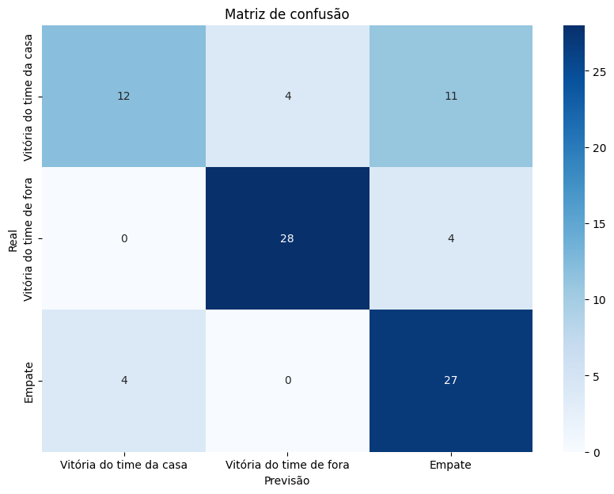
  
  <sup>Fonte: Material produzido pelos autores (2024)</sup>
  
</div>


##### **Discussão dos Resultados**

O modelo apresentou os seguintes resultados:

<div align="center">
  
  <sup> Figura X - Apresentação das Métricas</sup>
  
  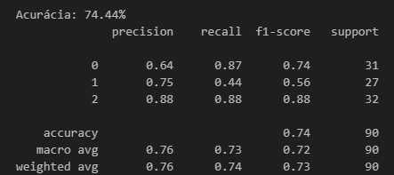
  
  <sup>Fonte: Material produzido pelos autores (2024)</sup>
  
</div>


- **Acurácia**: A acurácia obtida foi de 74,44%, o que significa que, em média, o modelo acertou cerca de 74% das previsões.

- **Precisão**: A precisão reflete a proporção de acertos entre as previsões feitas para cada classe. Por exemplo, a precisão para vitória do visitante foi de 0.88, o que significa que 88% das previsões para esse resultado estavam corretas.

- ***Recall***: A revocação mostra a capacidade do modelo de encontrar todos os casos positivos reais. Para empate, a revocação foi de 87%, o que indica que o modelo identificou corretamente a maioria dos empates.

- **Curva ROC**: A área sob a curva (AUC) foi de 0.89, o que indica que o modelo possui uma boa capacidade de distinguir entre as diferentes classes.

<div align="center">
    
  <sup> Gráfico X - Curva ROC</sup>
  
  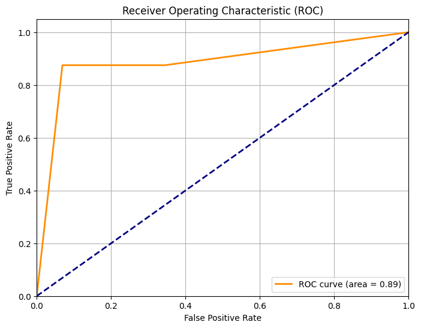
  
  <sup>Fonte: Material produzido pelos autores (2024)</sup>

</div>

<div align="center"> 
  
  

</div>
Esses resultados indicam que o modelo Random Forest é adequado para esse tipo de problema, apresentando uma boa acurácia e boas métricas de precisão e *recall*. Contudo, há margem para melhorias, como inclusão de novas *features* relevantes e identificar motivos para o modelo ainda apresentar um *recall* tão baixo para as vitórias da casa.

### 4.4. Comparação de Modelos

#### 1. Qual jogador tem a maior probabilidade de marcar gols na partida?

&nbsp;&nbsp;&nbsp;&nbsp; Os presentes modelos a seguir buscam prever os resultados para a seguinte pergunta: “Qual jogador tem a maior probabilidade de marcar gols na partida?”. Foram realizados dois modelos com o mesmo objetivo porém com abordagem diferente, os modelos se tratam do *Random Forest* de regressão e o Lasso. Além disso, também foi se realizado uma unificação desses dois modelos em um nootebook para a comparação dos mesmos. Abaixo é possivel acessar os notebooks dos modelos.

- [Modelo de *Random forest* de regressão](notebooks/QuaisJogadoresFaraoOGol/randomForest.ipynb)

- [Modelo de Lasso](notebooks/QuaisJogadoresFaraoOGol/HipoteseLasso.ipynb)

- [Modelo de comparação](notebooks/QuaisJogadoresFaraoOGol/comparacao.ipynb)

#### 1.1. Modelos

&nbsp;&nbsp;&nbsp;&nbsp;O *Random Forest* de Regressão é um modelo que combina várias árvores de decisão para prever valores numéricos. Ele funciona criando várias árvores independentes com subconjuntos dos dados, e a previsão final é obtida pela média das previsões de todas as árvores. Essa abordagem reduz erros e melhora a precisão, especialmente em problemas com muitas variáveis e interações complexas como é o caso.

&nbsp;&nbsp;&nbsp;&nbsp;O LASSO (_Least Absolute Shrinkage and Selection Operator_) é uma técnica de regressão que combina a minimização do erro residual com a adição de uma penalidade proporcional à soma dos valores absolutos dos coeficientes do modelo. Essa abordagem reduz o impacto de variáveis menos relevantes, forçando alguns coeficientes a serem exatamente zero, o que resulta na seleção automática de features importantes. Além de melhorar a interpretabilidade do modelo, o LASSO é útil para evitar o overfitting em situações onde há muitas variáveis explicativas, tornando-o ideal para cenários com alta dimensionalidade. [[-1]](#6-referências)


#### 1.1.1. Métricas de avaliação e resultado 

&nbsp;&nbsp;&nbsp;&nbsp;Para avaliar o desempenho do modelo de Random Forest de Regressão e do LASSO, foram utilizadas três métricas principais: **MAE**, **MSE** e **R²**. Essas métricas foram escolhidas por suas propriedades distintas e complementares, proporcionando uma análise abrangente da precisão e da qualidade das previsões feitas pelo modelo. Abaixo está detalhado cada uma dessas métricas juntamente com os resultados obtidos na análise.

##### 1.1.1.1. **MAE (Erro Médio Absoluto)**
&nbsp;&nbsp;&nbsp;&nbsp;O **MAE** (Erro Médio Absoluto) mede a média do erro absoluto entre os valores previstos e os reais. Ele fornece uma noção do quão longe, em média, as previsões estão dos valores reais. Essa métrica não penaliza os *outliers* (valores discrepantes). [[22]](#6-referências)


```python
# Random Forest
mae = mean_absolute_error(y_test, predicoes_teams)
print(f'Erro Absoluto Médio (MAE): {mae}')

Resultado: Erro Absoluto Médio (MAE): 0.3613037174576835
```
```python
# LASSO
mae = mean_absolute_error(y_filtered, predictions)
print(f'Erro Absoluto Médio (MAE): {mae}')

Resultado: Erro Absoluto Médio (MAE): 0.14756524180663497
```

- **Interpretação:** Quanto menor o MAE, mais precisas são as previsões.

##### 1.1.1.2. **MSE (Erro Quadrático Médio)**
&nbsp;&nbsp;&nbsp;&nbsp;O **MSE** mede a média dos erros quadrados entre os valores previstos e os reais. Ao elevar os erros ao quadrado, o MSE penaliza mais fortemente erros maiores, se tornando mais sensível a outliers. [[22]](#6-referências)

```python
# Random Forest
mse = mean_squared_error(y_test, predicoes_teams)
print(f'Mean Squared Error: {mse}')

Resultado: Mean Squared Error: 0.8026209204035488
```
```python
# LASSO
mse = mean_squared_error(y_filtered, predictions)
print(f'Mean Squared Error: {mse}')

Resultado: Mean Squared Error: 0.03330119281285796
```

- **Interpretação:** Quanto menor o MSE, melhor o desempenho do modelo. 

##### 1.1.1.3. **R² (Coeficiente de Determinação)**
&nbsp;&nbsp;&nbsp;&nbsp;O **R²** indica a proporção da variância dos dados que é explicada pelo modelo. Ele varia de 0 a 1, sendo 1 um ajuste perfeito, ou seja, o modelo explicando toda a variação nos dados. [[22]](#6-referências)

```python
# Random Forest
r2 = r2_score(y_test, predicoes_teams)
print(f'R² Score: {r2}')

Resultado: R² Score: 0.9412817524396443
```
```python
# LASSO
r2 = r2_score(y_filtered, predictions)
print(f'R² Score: {r2}')

Resultado: R² Score: 0.5495785180414283
```

- **Interpretação:** Um valor próximo de 1 significa que o modelo faz boas previsões, enquanto valores próximos de 0 indicam um modelo fraco.

&nbsp;&nbsp;&nbsp;&nbsp;Essas métricas, juntas, proporcionam uma visão completa do desempenho dos modelos. Enquanto o MAE oferece uma noção clara da precisão média, o MSE permite avaliar a sensibilidade do modelo a erros significativos e o R² fornece uma compreensão geral da capacidade explicativa dos modelos. Dessa forma, a análise das métricas escolhidas possibilita uma avaliação mais rica e informada da qualidade das previsões em ambos modelos.

#### 1.1.2. Ajustes de hiperparâmetros 

&nbsp;&nbsp;&nbsp;&nbsp;O ajuste de hiperparâmetros, ou tuning de hiperparâmetros, é uma etapa no desenvolvimento de modelos de aprendizado de máquina. Hiperparâmetros são configurações que definem o comportamento de um algoritmo de aprendizado e não são aprendidos durante o treinamento, ao contrário dos parâmetros do modelo. A escolha adequada desses valores pode impactar significativamente a performance e a eficácia do modelo em prever resultados. [[-2]](#6-referências)

&nbsp;&nbsp;&nbsp;&nbsp;Para o ajuste de hiperparâmetro foi utilizado o gridsearch pois ele realiza uma busca exaustiva[[23]](#6-referências) por meio de um grid pré-definido de valores possíveis para cada hiperparâmetro, para o modelo de Random Forest, os hiperparâmetros escolhidos para ajuste foram:

#### Random Forest

- `n_estimators:` Este parâmetro determina o número de árvores na floresta. Os valores testados foram 10, 50, 100 e 200. Aumentar o número de árvores pode melhorar a precisão do modelo. No entanto, também pode aumentar o tempo de computação.


- `max_depth:` Este parâmetro controla a profundidade máxima de cada árvore, ajudando a evitar o overfitting. Os valores testados foram None (sem limite), 10, 20, 30 e 40. Limitar a profundidade das árvores pode resultar em um modelo mais simples e, muitas vezes, mais generalizável.


```python
param_grid = {
    'n_estimators': [10, 50, 100, 200],
    'max_depth': [None, 10, 20, 30, 40],
}
```

#### LASSO
- `alpha:` Este parâmetro controla a força da penalização no modelo LASSO. Ele define o grau de regularização, onde valores maiores de alpha aumentam a penalidade aplicada aos coeficientes, forçando-os a se aproximarem de zero. Isso resulta em um modelo mais simples, com menos features, ajudando a evitar o overfitting. Os valores testados podem variar, como 0.001, 0.01, 0.1, 1 e 10. Valores mais baixos mantêm mais variáveis no modelo, enquanto valores maiores eliminam as menos importantes, promovendo uma maior seleção de features e generalização do modelo. [[-1]](#6-referências)

```python 
param_grid = {
  'alpha': np.logspace(-4, 1, 50) # [1.00000000e-04, 1.26485522e-04, 1.59985872e-04, ..., 6.30957344e+00, 7.96262332e+00, 1.00000000e+01]

```

#### Gols por jogador:
##### Descrição:
&nbsp;&nbsp;&nbsp;&nbsp;Na solução final, dois modelos preditivos foram treinados e comparados: Lasso Regression e Random Forest. O objetivo é prever a quantidade de gols dos jogadores em uma partida, considerando diversas variáveis relacionadas a desempenho individual e coletivo.

```
Random Forest:
Modelo baseado em árvores de decisão, configurado com 100 estimadores e
profundidade máxima de 10, utilizado pela sua habilidade de capturar
interações complexas entre as variáveis.
``` 
[[21]](#6-referências)

```
Lasso Regression: 
Modelo de regressão linear regularizado, com alpha de 0.01, escolhido
pela sua capacidade de simplificar o modelo ao reduzir a influência de
variáveis menos relevantes, resultando em maior interpretabilidade.
``` 
[[22]](#6-referências)

As seguintes métricas foram escolhidas para comparação dos modelos: MAE, MSE e R² [[23]](#6-referências).

No contexto do projeto enxergamos a importância das métricas da seguinte forma: 
- O MSE nos ajuda a minimizar erros, garantindo previsões mais precisas sobre resultados dos jogos.
- O MAE nos permite apresentar uma métrica de erro mais simples de interpretar, importante para comunicar resultados claros.
- Já o R² destaca a capacidade do modelo de explicar a variabilidade dos resultados.

##### Justificativa:

&nbsp;&nbsp;&nbsp;&nbsp;O seguinte [notebook](https://github.com/Inteli-College/2024-2A-T14-IN03-G03/blob/feat/comparacao_jogadores/notebooks/QuaisJogadoresFaraoOGol/comparacao.ipynb) nos entrega as métricas de ambos os modelos permitindo que comparemos ambos.

&nbsp;&nbsp;&nbsp;&nbsp;Comparação das Métricas dos Modelos:

| Modelo         | MSE      | MAE      | R²       |
|----------------|----------|----------|----------|
| Lasso          | 0.032292 | 0.148828 | 0.548063 |
| Random Forest  | 0.802621 | 0.361304 | 0.941282 |

&nbsp;&nbsp;&nbsp;&nbsp;Os dois modelos foram selecionados para fornecer previsões sobre o desempenho dos jogadores. O _Random Forest_ se justifica pelo excelente desempenho em explicar a variabilidade dos dados, com um R² de 0.941. Isso mostra que o modelo captura bem as nuances do conjunto de dados, tornando-o mais preciso para previsões globais e complexas.

&nbsp;&nbsp;&nbsp;&nbsp;Por outro lado, o _Lasso Regression_ foi mantido devido à sua capacidade de regularizar variáveis, simplificando o modelo. Embora tenha um R² de 0.548, seu MAE de 0.1488 indica que, em muitos casos, ele consegue fazer previsões com menor erro absoluto, o que pode ser útil em cenários onde a consistência de previsões é mais importante que a abrangência de variáveis.

&nbsp;&nbsp;&nbsp;&nbsp;Podemos ainda fazer uma análise sobre a importancia de cada modelo para nossas personas:

&nbsp;&nbsp;&nbsp;&nbsp;<b>Diretor de Parcerias:</b> O Diretor de Parcerias busca soluções que ofereçam valor imediato aos parceiros. O _Random Forest_, com um R² de 0.941, garante previsões precisas, tornando a aplicação mais atraente para parceiros interessados em análises de desempenho confiáveis. O _Lasso Regression_, com MAE de 0.1488, pode ser promovido para parceiros que priorizam previsões consistentes e estáveis. Ambos os modelos oferecem flexibilidade, atendendo diferentes usuários e agregando valor à aplicação.

&nbsp;&nbsp;&nbsp;&nbsp;<b>Administrador da Aplicação:</b> O Administrador precisa de um modelo fácil de manter e eficiente. O _Random Forest_ é poderoso, mas sua complexidade pode exigir menos atualizações frequentes devido à alta precisão. O _Lasso Regression_ é mais simples de gerenciar, focando nas variáveis mais relevantes, facilitando a manutenção e atualizações com menor esforço computacional.

&nbsp;&nbsp;&nbsp;&nbsp;**Interpretação das Métricas:**
_Random Forest_ apresentou um desempenho superior com um R² de 0.941, o que significa que o modelo explica mais de 94% da variabilidade no conjunto de dados, tornando-o o modelo mais robusto para previsões globais.
No entanto, o _Lasso Regression_ tem uma vantagem no erro absoluto médio (MAE de 0.1488), o que significa que, em termos de previsões individuais, ele comete erros menores de forma mais consistente, mesmo com um R² inferior de 0.548. Além disso o _Random Forest_, com um R² de 0.941, apresenta um modelo altamente preciso, o que é fundamental para atrair novos parceiros que buscam previsões confiáveis e detalhadas. No entanto, esse valor elevado também pode indicar uma maior tendência ao _overfitting_, onde o modelo se ajusta muito bem aos dados de treinamento, mas pode ter dificuldades ao generalizar em novos dados


#### Primeiro time a marcar gol:
##### Descrição:

&nbsp;&nbsp;&nbsp;&nbsp;Na comparação dos dois modelos preditivos, os resultados demonstram um desempenho distinto em relação à acurácia, que é um dos principais indicadores de eficácia. O Modelo 1 obteve um total de 158 acertos e 63 erros, resultando em uma acurácia de aproximadamente 71,46%. Por outro lado, o Modelo 2 teve um desempenho superior, com 169 acertos e 59 erros, alcançando uma acurácia de cerca de 74,34%. Além disso, o Modelo 2 também apresentou 14 indeterminações, o que significa que, em algumas situações, ele não conseguiu emitir uma previsão clara.

&nbsp;&nbsp;&nbsp;&nbsp;A escolha das métricas utilizadas para a comparação dos modelos, incluindo a acurácia, foi justificada na Seção 4.1, onde abordamos a importância de entender as especificidades do negócio e as personas envolvidas. A acurácia é crucial, mas em contextos onde as classes de resultados são desbalanceadas, métricas complementares como precisão, recall e F1-score devem ser consideradas. No nosso caso, o Modelo 2 não apenas teve uma maior acurácia, mas a análise das indeterminações também fornece informações relevantes sobre a sua capacidade de generalização e adaptabilidade em situações complexas.

&nbsp;&nbsp;&nbsp;&nbsp;Além disso, em caso de falha nas predições, temos um plano de contingência robusto. Esse plano inclui um monitoramento contínuo das previsões e a reavaliação dos dados utilizados, com a coleta de feedback dos usuários para ajustar o modelo conforme suas necessidades. Se as taxas de acerto caírem, a equipe considerará a implementação de algoritmos alternativos para aprimorar a precisão.

&nbsp;&nbsp;&nbsp;&nbsp;A explicabilidade do modelo é um fator fundamental para a aceitação dos resultados. O Modelo 2, com um maior número de acertos e a capacidade de identificar indeterminações, oferece maior transparência nas suas previsões. Isso permite que analistas e torcedores compreendam as razões por trás das decisões do modelo, fortalecendo a confiança na utilização das previsões. Portanto, a escolha do Modelo 2 se justifica não apenas pelos resultados numéricos superiores, mas também pela sua adequação às necessidades dos usuários e pela sua capacidade de oferecer explicações compreensíveis, tornando-o mais eficaz em um contexto dinâmico e complexo como o do futebol.


### 4.5. Avaliação

#### 4.5.1. Descrição de modelos finais

&nbsp;&nbsp;&nbsp;&nbsp; Após extenso processo de testagem de diferentes modelos, comparação de métricas e modificações nas bases de dados, chegou-se a uma série de modelos selecionados para responder as principais questões e hipóteses propostas neste documento.

&nbsp;&nbsp;&nbsp;&nbsp;Nesse sentido, esta seção tem como objetivo discorrer sobre os modelos finais, expondo seu funcionamento trazendo como estes estão relacionados à proposta do projeto à solução do problema inicialmente apresentado.

&nbsp;&nbsp;&nbsp;&nbsp;Inicialmente, como descrito na [Seção 2](#2-objetivos-e-justificativa) deste documento, temos como objetivo dos modelos preditivos desenvolvidos responder questões relacionadas ao resultado de partidas de futebol da Série A do Campeonato Brasileiro, especificamente, buscou-se responder as seguintes indagações:

- Dados dois times, qual a chance de vitória de cada um deles?
- Dados dois times, qual tem maior chance de fazer o primeiro gol?
- Dados dois times, qual a chance que cada jogador tem de fazer um gol?

&nbsp;&nbsp;&nbsp;&nbsp;Para tal, também mencionado anteriormente, foram feitos diversos testes com diferentes algoritmos de análise estatística e inteligência artificial para alcançar tais metas, chegando a três modelos finais capazes de descrever o comportamento do jogo, times e jogadores de maneira a realizar predições confiáveis acerca desses resultados.

&nbsp;&nbsp;&nbsp;&nbsp;Nesse contexto, o primeiro modelo, responsável por determinar a chance de vitória de cada time em uma determinada partida, foi desenvolvido utilizando-se o algoritmo Random Forest e tendo como bases de dados informações sobre as partidas ocorridas ao longo do campeonato e os times que disputaram essas partidas. Esse modelo alcançou uma acurácia (medida da quantidade de acertos dividido pela quantidade de previsões realizadas) de 72,22%.

&nbsp;&nbsp;&nbsp;&nbsp;Ademais, tem-se ainda o modelo responsável pela predição de qual time tem a maior chance de marcar o primeiro ponto de uma partida. Esse modelo foi construído utilizando uma combinação de algoritmos, utilizando, primordialmente, K-means para agrupamento dos times do campeonato em _clusters_ de times suficientemente semelhantes e, em seguida, uma análise de probabilidade empírica para cálculo das chances de ambos os times serem o primeiro a pontuar. Esse modelo alcançou uma acurácia de 69,8%

&nbsp;&nbsp;&nbsp;&nbsp;O modelo capaz de descrever, com base nos dados dos jogadores, quais são aqueles com maior probabilidade de fazer gol durante uma partida. Esse modelo se utiliza do método de regressão Lasso para gerar suas predições, organizando a chance que cada jogador possui de fazer o primeiro gol em ordem decrescente. Este modelo alcançou um valor de MAE (_Mean absolute error_, Média do absoluto do erro) de 0,1488.

&nbsp;&nbsp;&nbsp;&nbsp;Cabe ressaltar que a comparação desses modelos e explicações acerca de suas métricas podem ser encontradas adiante na [Seção 4.4](#44-comparação-de-modelos), enquanto descrições do funcionamento dos modelos estão disponíveis adiante nesta seção.

#### 4.5.2. Validação de hipóteses

&nbsp;&nbsp;&nbsp;&nbsp;Nesta subseção, discutimos as hipóteses formuladas na seção 4.2.3, analisando os dados coletados e os modelos implementados. A aceitação ou refutação das hipóteses é fundamentada para análise de resultados obtidos e determinação da efetividade dos modelos criados.

**Hipótese 1: O Time Visitante tem Maior Probabilidade de Vitória ao Marcar o Primeiro Gol**

- **Descrição da Hipótese**: Esta hipótese sugere que, quando o time visitante marca o primeiro gol, suas chances de vitória aumentam significativamente.
- **Resultados Obtidos**: A modelagem que utilizamos para analisar essa hipótese foi realizada no notebook ["Modelagem do notebook escalacao.ipynb"](../notebooks/External/escalacao.ipynb). Utilizou-se o modelo Random Forest Classifier, configurado com 100 estimadores. O modelo apresentou uma acurácia de 55%, revelando desafios em prever empates. A matriz de confusão indicou que o modelo teve dificuldades em classificar corretamente as partidas equilibradas (jogos com desempenhos semelhantes entre os times), sugerindo que ajustes nas *features* ou na modelagem seriam necessários para aumentar a precisão.
- **Análise de Resultados**:  Embora a acurácia seja de 55%, os dados mostram uma tendência consistente de que quando o time visitante marca o primeiro ponto ele apresenta uma maior probabilidade de vencer. Isso é evidenciado pela matriz de confusão, que mostra que a maioria das partidas nas quais o visitante marcou o primeiro gol resultou em vitórias para esse time. No entanto, a dificuldade em prever empates sugere que outros fatores, como a força do adversário(capacidade do time adversário, medido por sua performance em jogos anteriores, posição na tabela e nível técnico) e condições de jogo, também influenciam significativamente os resultados.
- **Conclusão**: Hipótese aceita. Os dados sustentam a ideia de que o time visitante que marca primeiro possui maior probabilidade de vencer. Contudo, fatores adicionais, como a força do adversário, podem ser explorados em análises futuras.

**Hipótese 2: Diferenças no Número de Partidas Jogadas Afetam as Estatísticas de Desempenho**

- **Descrição da Hipótese**: Esta hipótese sugere que times com um maior número de partidas jogadas podem apresentar distorções nas estatísticas de desempenho, impactando negativamente as previsões.
- **Resultados Obtidos**: A análise foi realizada no notebook ["Modelagem do notebook QualJogadorFazerGol.ipynb (quais jogadores têm mais chance de fazer o primeiro gol)"](../notebooks/QuaisJogadoresFaraoOGol/QualJogadorFazerGol.ipynb). Inicialmente, utilizou-se o modelo Random Forest Classifier, que apresentou uma acurácia de 100%, o que indicou um possível *overfitting*(quando o modelo se ajusta demais aos dados de treino e tem dificuldade em generalizar para novos dados). Após a análise da matriz de confusão e identificação dos erros, decidiu-se mudar para o Random Forest Regressor, uma vez que essa abordagem permite lidar melhor com probabilidades contínua, ao invés de apenas classificar resultados. Essa mudança foi significativa, pois o Random Forest Regressor é mais adequado para tratar problemas em que as saídas são variáveis contínuas(no caso, as probabilidades de qual jogador tem mais chance de fazer o gol). Essa alteração permitiu uma modelagem mais refinada e ajustada à realidade dos dados
Com a aplicação de PCA (Análise de Componentes Principais), foi possível reduzir a dimensionalidade dos dados, o que contribuiu para a melhoria do desempenho do modelo. Isso se refletiu na redução do MSE (Erro Quadrático Médio) para 3, o que indica que o erro médio entre as previsões e os valores reais diminuiu. Um MSE de 3 pode ser considerado um bom valor dependendo da escala dos dados — quanto menor, melhor, pois indica menos erros. Além disso, o R² (Coeficiente de Determinação) aumentou para 0,59, o que significa que o modelo conseguiu explicar 59% da variação dos dados. 
- **Análise dos Resultados**: Análise dos Resultados: A adoção do Random Forest Regressor e do PCA evidenciou a importância de ajustar corretamente os dados para evitar distorções nas previsões. Embora as variáveis relacionadas ao número de partidas jogadas apresentassem algum impacto, ele foi menor do que o esperado.
- **Conclusão**: Hipótese parcialmente aceita. Embora haja distorções nas variáveis relacionadas à quantidade de partidas jogadas, o impacto direto no desempenho geral (como gols) não foi tão significativo quanto o esperado. Uma abordagem mais robusta para a normalização dos dados poderia ajudar a mitigar essa distorção.

**Hipótese 3: Times da Casa Recebem Menos Cartões Amarelos que os Visitantes**

- **Descrição da Hipótese**: Esperava-se que os times jogando em casa recebessem menos cartões amarelos do que os visitantes.
- **Resultados Obtidos**:  Os dados foram analisados no notebook ["Modelagem do notebook RandomForest_Predicao_Vencedor_Futebol.ipynb - Vencedor de Partidas (%)"](../notebooks/RandomForest_Predicao_Vencedor_Futebol.ipynb). O modelo Random Forest foi utilizado para prever o vencedor das partidas com base em diversas *features* relacionadas ao desempenho das equipes. Os resultados mostraram que os times da casa receberam mais cartões amarelos do que os visitantes.
- **Análise dos Resultados**:A matriz de confusão e as métricas utilizadas (acurácia, precisão e F1-Score) não mostraram uma tendência clara em favor da hipótese. Em vez disso, os dados indicaram que os times da casa receberam mais cartões amarelos, sugerindo que fatores como arbitragem ou pressão da torcida podem influenciar as decisões dos árbitros.
- **Conclusão**:  Refutação. Os resultados contradizem a hipótese original. Essa descoberta sugere a necessidade de investigar fatores adicionais que possam influenciar as decisões dos árbitros.

#### 4.5.3. Explicabilidade e funcionamento dos modelos

&nbsp;&nbsp;&nbsp;&nbsp;Partindo para uma análise mais aprofundada dos modelos gerados, esta subseção almeja explicar o funcionamento dos modelos, descrevendo os algoritmos utilizados de modo a explicitar como cada um deles realiza suas predições e o que embasa os resultados dos modelos.

**Modelo para chance de vitória**

&nbsp;&nbsp;&nbsp;&nbsp;Começando com o modelo que prediz a chance de vitória de cada time em uma partida. Para esse modelo, foi utilizado o algoritmo de classificação Random Forest. Tal algoritmo realiza predições por meio da construção de diversas [árvores de decisão](https://www.ibm.com/topics/decision-trees) distintas, passando um mesmo dado por elas e classificando-o com base no resultado mais recorrente encontrados pelas árvores individuais. 

&nbsp;&nbsp;&nbsp;&nbsp;Como citado anteriormente, este modelo alcançou uma acurácia 72,22%, o que, apesar de ser um valor alto para predições complexas como aquelas que estamos realizando, não é suficiente para descrever o comportamento do modelo prever os resultados. Nesse sentido, recorremos a outras métricas para análise da eficácia do modelo, tais como precisão (_precision_), revocação (_recall_) e o F1-score. Tais medidas são relevantes ao informar a natureza das predições realizadas pelos modelos, de modo a permitir que averiguemos se ela está condizente com as necessidades do parceiro. Nesse sentido, agrupou-se esses resultados para cada um dos tipos de previsão que o modelo abrange, estando descritos na Tabela 04: 

<div align='center'>
<sup>Tabela 04 - Tabela de métricas do modelo de time vencedor</sup>

| Predição                   | Precisão | Revocação| F1-score |
|----------------------------|:--------:|:--------:|:--------:|
| Vitória da time da casa    |   0,78   |   0,42   |   0,55   |
| Empate                     |   0,71   |   0,92   |   0,80   |
| Vitória do time visitante  |   0,79   |   0,87   |   0,82   |

<sup>Fonte: Material Produzido pelos autores (2024)</sup>
</div>

&nbsp;&nbsp;&nbsp;&nbsp;Como podemos observar, os modelo em questão apresenta medidas satisfatórias de precisão e revocação. Pode-se perceber que o modelo também demonstra valores consistentes de precisão, indicando uma sensibilidade considerável para a identificação de verdadeiros positivos dentre os verdadeiros e falsos positivos. No contexto do projeto, é importante que tal medida apresente valores altos, pois indica que o modelo tem chances maiores de que as previsões realizadas sejam realmente condizentes com a realidade, o que contribui para a construção de confiança do usuário na aplicação.

**Modelo para chance de primeiro gol**

&nbsp;&nbsp;&nbsp;&nbsp;Em seguida, tem-se o modelo responsável pela predição de qual time tem a maior chance de marcar o primeiro ponto de uma partida. Esse modelo foi construído utilizando uma combinação de algoritmos, com ênfase na utilização do algoritmo K-means para realizar o agrupamento dos times do campeonato em _clusters_ de equipes suficientemente semelhantes. O agrupamento permitiu que as equipes fossem classificadas com base em características específicas de desempenho, facilitando a análise preditiva. 

&nbsp;&nbsp;&nbsp;&nbsp;Após a etapa de agrupamento, aplicou-se uma análise de probabilidade empírica para calcular as chances de cada time ser o primeiro a pontuar. Esse processo envolveu a análise de dados históricos sobre o desempenho dos times, considerando a frequência com que cada time foi o primeiro a marcar contra adversários de diferentes _clusters_. A partir desses dados, determinou-se a probabilidade de cada time iniciar o placar de acordo com as condições da partida e o perfil de seus oponentes. Nesse sentido, podemos sintetizar a probabilidade de que um time seja o primeiro a fazer o gol contra um adversário através da seguinte equação:

<div align='center'>

$P(1° gol) = \frac{G_{AB}}{T_{pAB}}$

</div>

&nbsp;&nbsp;&nbsp;&nbsp;Na qual a probabilidade de um time $A$ ser o primeiro a pontuar numa disputa contra um determinado time $B$ é $P(1° gol)$, enquanto $G_{AB}$ representa o total de partidas que um determinado time $A$ foi o primeiro a marcar gols contra times do mesmo _cluster_ de um time $B$, e $T_{pAB}$ representa a quantidade total de partidas disputadas entre o time $A$ contra times do grupo do time $B$, incluindo o próprio time $B$.

&nbsp;&nbsp;&nbsp;&nbsp;Realizando essa operação para ambos os times de uma partida, podemos comparar essas probabilidades a fim de determinar qual dos dois têm maior probabilidade de fazer o primeiro gol.

&nbsp;&nbsp;&nbsp;&nbsp;Esse modelo atingiu uma acurácia de 69,8% (calculada considerando o resultado mais provável como resultado da previsão e comparando com os resultados reais), o que demonstra um desempenho expressivo, dado o nível de imprevisibilidade associado ao futebol. A acurácia reflete a capacidade do modelo de identificar corretamente os times com maior probabilidade de marcar primeiro em uma amostra de partidas, o que é um avanço importante para melhorar a experiência dos usuários da aplicação.

**Modelo para chance de gol por jogador**

&nbsp;&nbsp;&nbsp;&nbsp;Por fim, o último modelo desenvolvido no contexto do projeto foi aquele capaz de identificar, com base nos dados dos jogadores, quais possuem maior probabilidade de fazer o primeiro gol durante uma partida. Para esse fim, foi utilizado o método de regressão Lasso, uma técnica que combina a [regressão linear](https://www.ibm.com/br-pt/topics/linear-regression) com a regularização dos coeficientes, permitindo uma seleção de variáveis mais eficiente. Isso possibilita que o modelo priorize os fatores mais relevantes para predizer a chance de um jogador marcar, ao mesmo tempo em que minimiza o impacto de características menos importantes.

&nbsp;&nbsp;&nbsp;&nbsp;O modelo funciona realizando uma busca, na base de dados específica dos jogadores do campeonato, das informações dos jogadores de duas equipes que disputarão uma partida, analisando seu desempenho histórico e características específicas. Com base nessas informações, a regressão Lasso é aplicada para traçar o comportamento dos jogadores, e, em seguida, o modelo calcula a probabilidade de cada um marcar gol durante a partida, por fim, ordenando-as em ordem decrescente, facilitando a identificação daqueles com maior probabilidade de marcar o primeiro gol. 

&nbsp;&nbsp;&nbsp;&nbsp;A precisão do modelo foi avaliada através do _Mean Absolute Error_ (MAE), que mensura a média das diferenças absolutas entre os valores previstos e os valores reais. O modelo alcançou um MAE de 0,1488, o que indica uma boa capacidade preditiva, visto que quanto mais próximo de zero, menor o erro nas previsões. No entanto, o coeficiente de determinação (R²) ficou abaixo de 0,548, sugerindo que o modelo ainda tem limitações em capturar a variabilidade dos dados e que há espaço para melhorias e ajustes.

&nbsp;&nbsp;&nbsp;&nbsp;Esses resultados são úteis para orientar estratégias durante a partida, auxiliando a equipe técnica na tomada de decisões sobre quais jogadores têm maior potencial de finalização, mesmo que haja margem para aprimoramento na precisão do modelo.

#### 4.5.4. Plano de contingência

&nbsp;&nbsp;&nbsp;&nbsp;Por fim, compreendendo os impactos da solução no contexto do parceiro, construiu-se um plano de contingência para possíveis erros dos modelos gerados. Esse plano é relevante, também, para garantir a confiabilidade do sistema e para mitigar os efeitos de potenciais falhas na performance dos modelos de inteligência artificial.

&nbsp;&nbsp;&nbsp;&nbsp;Para tal, propõe-se um fluxo de trabalho simples, que tem como objetivo estruturar a resposta rápida e eficaz diante de problemas. Esse fluxo é desenhado para garantir que cada erro seja tratado de forma metódica e transparente, aumentando a confiança dos usuários no sistema. O processo envolve a análise inicial do problema, a identificação da sua origem, a tentativa de resolução e, por fim, a testagem da solução. A seguir, detalha-se cada uma dessas etapas:

1. **Análise inicial do problema**: Ao identificar um erro no funcionamento do modelo, a primeira etapa envolve coletar informações sobre o problema. Isso pode incluir a verificação do processamento das funções que compõe o modelo e a verificação das entradas e saídas do modelo. Nessa fase, é importante compreender se o erro está associado a questões de desempenho, precisão preditiva, ou falhas nos dados de entrada.

2. **Identificação da origem do problema**: Após uma análise preliminar, é necessário rastrear a causa raiz do problema. Aqui, a equipe técnica avalia se a falha tem origem em um erro de codificação, em dados inconsistentes ou incompletos, ou se está relacionada ao desempenho inadequado do modelo em cenários específicos. Pode ser necessário também revisar o processo de treinamento dos algoritmos, ajustando parâmetros ou atualizando dados de treinamento.

3. **Tentativa de resolução**: Com a causa identificada, passam-se para a fase de implementação de soluções. Essa etapa pode envolver a correção de bugs, o retreinamento dos modelos, a inclusão de novos dados, ou a aplicação de estratégias como ajuste de hiperparâmetros ou regularizações. O objetivo está em garantir que a solução atinja a causa identificada sem gerar efeitos colaterais no sistema.

4. **Testagem e averiguação da solução**: Após implementar uma possível solução, é importante testá-la em um ambiente controlado para verificar se o problema foi, de fato, superado e se a correção não comprometeu outras partes do sistema. Essa fase envolve a execução de testes com casos reais e simulados, para garantir que o modelo mantenha sua robustez e continue apresentando resultados consistentes.

&nbsp;&nbsp;&nbsp;&nbsp;Cabe ressaltar que, devido à natureza do projeto, que serve como um produto para expor o poder computacional da IBM e as potencialidades do uso da inteligência artificial em contextos diversos, as consequências de falhas no seu funcionamento estão mais relacionadas à perda de confiança no parceiro de projeto e em soluções semelhantes, do que a impactos materiais ou à integridade física de pessoas. Embora essa característica traga grande responsabilidade ao projeto, já que qualquer falha pode prejudicar a reputação da empresa e afetar a aceitação do sistema, ela também indica que os riscos associados são controlados, não havendo consequências críticas como as que poderiam ser observadas em projetos de saúde ou segurança pública, por exemplo.

&nbsp;&nbsp;&nbsp;&nbsp;O plano de contingência, assim, garante que mesmo em cenários adversos, a equipe poderá rapidamente identificar e corrigir problemas, minimizando possíveis danos à credibilidade do projeto e aos resultados apresentados ao parceiro.

## <a name="c5"></a>5. Conclusões e Recomendações

### 5.1. Pessoas afetadas pelo modelo

Os resultados gerados pelos modelos preditivos impactam diversas pessoas e grupos. Desde torcedores que buscam entender melhor as chances de seus times e jogadores favoritos, até empresas que utilizam essas previsões para tomar decisões relacionadas a quem patrocinar, a influência do modelo é ampla. Além disso, times de futebol e técnicos de times podem usar essas informações para desenvolver estratégias mais eficazes. Ao explorar essas interações, buscamos destacar a relevância social e emocional das previsões, mostrando como elas moldam comportamentos, expectativas e decisões.

#### 5.1.1. Empresas patrocinadoras

As empresas patrocinadoras de times de futebol podem utilizar os dados gerados pelo nosso modelo preditivo para tomar importantes decisões de negócios, como quais times ou jogadores patrocinar. Por exemplo, uma empresa busca patrocinar os times e/ou jogadores que estão em evidência no momento, ou seja, jogadores que estão jogando bem e marcando gols com frequência, assim como times que estão em boas posições nos campeonatos de futebol e estão ganhando partidas com frequência são os jogadores e times que terão preferência das empresas patrocinadoras.

Os dados gerados pelo modelo preditivo podem influenciar na escolha das empresas sobre qual time e/ou jogador patrocinar, por exemplo, se o modelo prever que um jogador específico tem maior chance de fazer gols, ou que um time específico tem maior chance de ganhar as partidas, logo, patrocinar eles seria mais vantajoso, uma vez que times ou jogadores vencedores possuem maior exposição na mídia e são reconhecidos com mais facilidade por possíveis consumidores das marca.

#### 5.1.2. Time de futebol

Considerando o contexto da administração de um time de futebol, existem diversas responsabilidades relacionadas ao financeiro, patrocínios, marketing e as expectativas do desempenho do time que afetam diretamente todas as outras áreas.

Os dados gerados pelo modelo preditivo possuem capacidade para influenciar diversas ações do time, como mudar estratégias de marketing, ou mudar a postura em relação aos patrocínios, permitindo que o time se adapte antecipadamente.

#### 5.1.3. Técnico de futebol

Como técnico de futebol, sua principal função é comandar um time de jogadores, assim como planejar e criar estratégias para cada partida, visando formar um time com os melhores jogadores utilizando as melhores posições e estratégias possíveis com foco em obter os melhores resultados a cada partida.

Os dados gerados pelo modelo preditivo podem influenciar o técnico a alterar suas estratégias, alterar a escalação do time e influenciar diretamente no resultado das partidas, assim como afeta os jogadores, que podem ser adicionados ou removidas da escalação.

#### 5.1.4. Jogador de futebol

O jogador de futebol é parte vital dos times de futebol e são diretamente afetados por decisões ou ações que partem dos times, dos técnicos e dos torcedores de futebol.

Os dados gerados pelo modelo preditivo tem capacidade de influenciar tanto positivamente quanto negativamente os jogadores. Por exemplo, supondo que o modelo preditivo antes do jogo preveu que um jogador específico possui uma pequena possibilidade de fazer um gol, isso pode influenciar o jogador a mudar sua estratégia de jogo ou pode afetar o seu psicológico e desmotivá-lo.

#### 5.1.5. Torcedor de futebol

O principal papel do torcedor de futebol é apoiar o time de diversas formas, como comprando ingressos e indo assistir as partidas presencialmente nos estádios e comprando produtos do time, como camisetas ou chuteiras.

Os dados gerados pelo modelo preditivo podem influenciar a quantidade de compras de ingressos em uma partida, por exemplo, se a chance de certo time ganhar sua próxima partida for muito baixa, uma parcela considerável dos torcedores pode deixar de ir ou de comprar ingressos para o jogo, uma vez que a probabilidade do time de ganhar é muito baixa.

5.2. Conclusões, recomendações e considerações finais

&nbsp;&nbsp;&nbsp;&nbsp;Os principais resultados do projeto indicam um desempenho significativo na predição de eventos em partidas de futebol por meio dos três modelos gerados pela equipe, todos usando diferentes abordagens de _machine learning_. O modelo de previsão de qual time tem maior probabilidade de marcar o primeiro gol foi capaz de alcançar uma acurácia de 69,8%. Esse valor reflete um desempenho expressivo, mas com potencial para melhorias. Já o modelo responsável por calcular a probabilidade de cada jogador marcar um gol, apresentou um MAE de 0,1488 e um R² inferior a 0,548, indicando uma precisão razoável, porém com limitações na explicação da variabilidade dos dados.

&nbsp;&nbsp;&nbsp;&nbsp;Esses resultados demonstram que os modelos têm potencial para gerar informações úteis no contexto esportivo, como prever quais jogadores ou equipes têm maior probabilidade de marcar um gol. Mais importante, a solução desenvolvida é capaz de demonstrar as potencialidades da inteligência artificial em áreas diversas, as quais, muitas vezes, podem não ser associadas imediatamente a essas técnicas. No entanto, considerando as limitações identificadas, recomenda-se algumas ações para o melhoramento da solução:

1. **Aprimoramento contínuo dos modelos**: Dado o R² inferior a 0,548 e a acurácia de 69,8%, sugere-se realizar ajustes finos, como o uso de novos dados e técnicas mais avançadas de ajuste de hiperparâmetros, para aumentar a precisão preditiva dos modelos.
   
2. **Uso cauteloso em decisões críticas**: Embora os modelos apresentem bons resultados, é importante utilizá-los como ferramentas complementares em análises esportivas, não sendo recomendável depender exclusivamente deles para tomadas de decisão estratégicas.

3. **Monitoramento, reavaliação e atualizações frequentes**: Implementar um protocolo de monitoramento contínuo para verificar o desempenho dos modelos ao longo do tempo, de modo que, sempre que forem observadas mudanças nos padrões de dados, os modelos devem ser reavaliados e revalidados. Considerando também a natureza dos dados, provenientes da Série A do Campeonato Brasileiro, considera-se necessária a constante atualização das bases de dados com o objetivo de manter a eficácia dos modelos realizar predições.

4. **Plano de contingência ativo**: Manter o fluxo de trabalho proposto para a rápida identificação e resolução de problemas, minimizando impactos negativos no uso dos modelos e garantindo a confiança dos usuários.

&nbsp;&nbsp;&nbsp;&nbsp;Essas recomendações visam maximizar o valor dos modelos enquanto mitigam potenciais riscos associados à sua aplicação. Desse modo, a IBM será capaz de se utilizar da proposta de solução de maneira proveitosa, podendo usá-la para promoção de serviços de dados próprios, captação de novos clientes e demonstração das potencialidades desse tipo de ferramenta.

## <a name="c6"></a>6. Referências

1. IBM. Disponível em: <https://www.ibm.com/br-pt>. Acesso em: 13 ago. 2024.

2. ESCRITÓRIO DE PROJETOS - INTELI. Projeto Parceiro Empresa IBM 3° módulo - modelo preditivo. São Paulo: Inteli - Instituto de Tecnologia e Liderança, 2024. 6 p.

3. CLOUDFLARE. What is Predictive AI? Disponível em: <https://www.cloudflare.com/pt-br/learning/ai/what-is-predictive-ai/>. Acesso em: 13 ago. 2024.

4. People + AI Guidebook. Disponível em: <https://pair.withgoogle.com/chapter/user-needs/>. Acesso em: 13 ago. 2024.

5. HOTZ, N. What is CRISP DM? Disponível em: <https://www.datascience-pm.com/crisp-dm-2/>. Acesso em: 03 set. 2024.

6. CHAPMAN, P et al. CRISP-DM 1.0 - Step-by-step data mining guide. [s.l: s.n.]. Disponível em <https://web.archive.org/web/20220401041957/https://www.the-modeling-agency.com/crisp-dm.pdf>. Acesso em: 03 set. 2024. 

7. FM2S. “IBM: Entenda Como Surgiu e Seu Impacto.” FM2S Blog, 18 Jan. 2023, <www.fm2s.com.br/blog/ibm/amp>. Accessed 8 Aug. 2024.

8. IBM Comunica. “A Corrida por Patentes.” IBM Blog, 14 Mar. 2022, <www.ibm.com/blogs/ibm-comunica/a-corrida-por-patentes>. Accessed 8 Aug. 2024.

9. Educação, G4. “Value Proposition Canvas: O Que é E Como Funciona Essa Metodologia? - G4 Educacão.” G4educacao.com, <g4educacao.com/portal/value-proposition-canvas>. Acesso em: 12 ago. 2024.

10. Grande, Canal Sonho. “Value Proposition Canvas: O Que é E Como Utilizar.” Canal Sonho Grande, 6 Sept. 2021, <www.canalsonhogrande.com.br/post/value-proposition-canvas>. Acesso em: 12 ago. 2024.

11. TEAM ASANA. Risk Matrix Template: Assess Risk for Project Success [2024] • Asana. Disponível em: <https://asana.com/pt/resources/risk-matrix-template>. Acesso em: 7 ago. 2024.

12. JONES ROBERTO NUZZI. Matriz de Risco e Oportunidades - Jones Roberto Nuzzi - Medium. Disponível em: <https://medium.com/@jonesroberto/matriz-de-risco-e-oportunidades-89a3d5f708ad#:~:text=A%20Matriz%20de%20Risco%20Oportunidades%20%C3%A9%20uma%20ferramenta%20de%20classifica%C3%A7%C3%A3o>. Acesso em: 8 ago. 2024.

13. Compliance toolkit: protecting charities from harm Chapter 2: Due diligence, monitoring and verifying the end use of charitable funds Tool 4: Risk management Risk matrix. [s.l: s.n.]. Disponível em: <https://assets.publishing.service.gov.uk/government/uploads/system/uploads/attachment_data/file/550692/Tool_4.pdf>. Acesso em: 8 ago. 2024.

14. Persona: o que é e como criar uma para a sua empresa. Disponível em: <https://www.rdstation.com/blog/marketing/persona-o-que-e/>.

15. MJV INNOVATION. Como montar o mapa da jornada do usuário. 2022. Disponível em: <https://www.mjvinnovation.com/pt-br/blog/como-montar-o-mapa-da-jornada-do-usuario/>. Acesso em: 1 set. 2024.

16. SILVA, L. A. da; PERES, S. M.; BOSCARIOLI, C. Introdução à mineração de dados: com aplicações em R. Rio de Janeiro: Elsevier, 2016.

17. SALAZAR, J. J. et al. Fair train-test split in machine learning: Mitigating spatial autocorrelation for improved prediction accuracy. Journal of Petroleum Science and Engineering, v. 209, p. 109885, fev. 2022.

18. ICMC Júnior. Random Forest. Disponível em: https://icmcjunior.com.br/random-forest/. Acesso em: 13 set. 2024.

19. ESCOLA DNC. Avaliação de Modelos de Machine Learning: Métricas e Técnicas Essenciais - Blog DNC. Disponível em: <https://www.escoladnc.com.br/blog/avaliacao-de-modelos-de-machine-learning-metricas-e-tecnicas-essenciais/>. Acesso em: 13 set. 2024.

20. JÚNIOR, C. DE O. Prevendo Números: Entendendo as métricas R2, MAE, MAPE, MSE e RMSE. Disponível em: <https://medium.com/data-hackers/prevendo-n%C3%BAmeros-entendendo-m%C3%A9tricas-de-regress%C3%A3o-35545e011e70>.

21. IBM. What Is Random Forest? | IBM. Disponível em: <https://www.ibm.com/topics/random-forest>. Acessado em: 13 set. 2024

22. SOUZA, Luís. Prevendo números: entendendo métricas de regressão. *Medium*, 16 nov. 2020. Disponível em: [https://medium.com/data-hackers/prevendo-n%C3%BAmeros-entendendo-m%C3%A9tricas-de-regress%C3%A3o-35545e011e70](https://medium.com/data-hackers/prevendo-n%C3%BAmeros-entendendo-m%C3%A9tricas-de-regress%C3%A3o-35545e011e70). Acesso em: 29 set. 2024.

23. SCHOOL DNA. Otimização de modelos de machine learning: Grid Search vs Random Search. Escola DNA, 2023. Disponível em: https://www.escoladnc.com.br/blog/otimizacao-de-modelos-de-machine-learning-grid-search-vs-random-search/. Acesso em: 29 set. 2024.

23. SOUZA, Luís. Prevendo números: entendendo métricas de regressão. *Medium*, 16 nov. 2020. Disponível em: [https://medium.com/data-hackers/prevendo-n%C3%BAmeros-entendendo-m%C3%A9tricas-de-regress%C3%A3o-35545e011e70](https://medium.com/data-hackers/prevendo-n%C3%BAmeros-entendendo-m%C3%A9tricas-de-regress%C3%A3o-35545e011e70). Acesso em: 29 set. 2024.

-1. ALLAN, K.; RODRIGUES, S. LASSO Clássico e Bayesiano. [s.l: s.n.]. Disponível em: <https://www.ime.usp.br/~kevinx/LASSO_Texto.pdf>. Acessado em: 29 set. 2024

-2. O que é o Ajuste de hiperparâmetros? — Métodos de ajuste de hiperparâmetros explicados — AWS. Disponível em: <https://aws.amazon.com/pt/what-is/hyperparameter-tuning/>. Acessado em: 29 set. 2024


## <a name="attachments"></a>Anexos
[ANEXO A - MATRIX DE RISCO COMPLETA](../documents/extras/Matrix%20de%20Risco%20completa%20.xlsx)

[ANEXO B - POLÍTICA DE PRIVACIDADE](../documents/extras/Política%20de%20Privacidade.pdf)

[ANEXO C - NOTEBOOK HIPÓTESE PRIMEIRO PONTO](../notebooks/hipotese_firstgoal_win.ipynb)

[ANEXO D - NOTEBOOK HIPÓTESE QUANTITATIVO DE DADOS](../notebooks/hipotese_firstgoal_win.ipynb)

[ANEXO E - NOTEBOOK HIPÓTESE CARTÕES](../notebooks/hipotese_card_home_away.ipynb)

[ANEXO F - DRIVE COM BASES DE DADOS](https://drive.google.com/drive/folders/1Hxvhdkt6nexQxpO4gwh-zQ87zWXeM2NW?usp=sharing)
